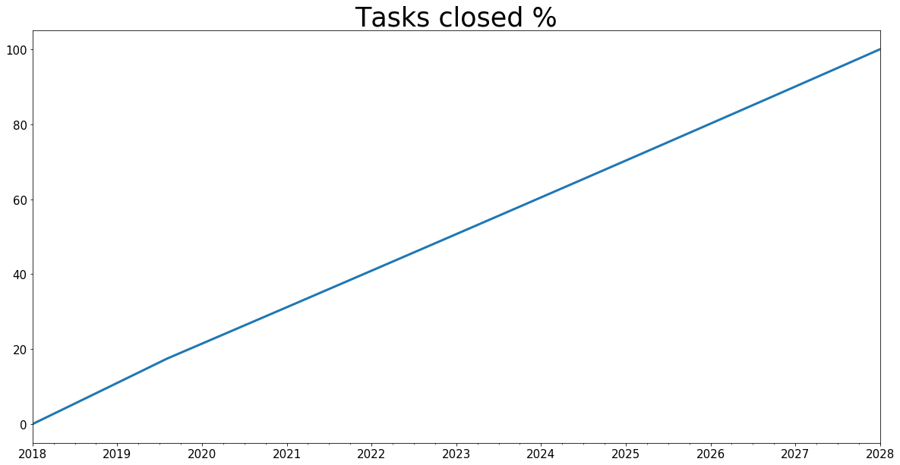

Accessing Raw Simulation Results
================================

.. meta::
   :description: How to access raw results in the BPTK-Py simulation framework.
   :keywords: agent-based modeling, abm, bptk, bptk-py, python

As we saw in the model checking section, you may obtain the raw
simulation results rather than the plot. To activate this feature, use
the ``return_df`` flag and set it to ``True``. The following cell
obtains these and stores the values in a variable "df". This way you are
able to work with the data outside ``BPTK_Py``!

.. code:: ipython3

    from BPTK_Py.bptk import bptk
    bptk = bptk()

.. code:: ipython3

    df = bptk.plot_scenarios(
        scenario_managers=["smSimpleProjectManagement"],
        scenarios=["scenario120"], 
        equations=["openTasks"],
        title="Deadline changes\n",
        x_label="Time",start_date="1/1/2018",freq="M",
        y_label="Marketing Budget (USD)",
        kind="line",
        return_df=True ## <--- HERE
        ,series_names = {"smSimpleProjectManagement_scenario120_openTasks" : "openTasks"}
        )

You may want to learn a little about the data. The following code calls
the ``head()`` and ``describe()`` functions of the dataFrame. Head
return the first 5 elements and Describe gives some important
information on the data. For instance, we learn that there are 121
elements in the dataFrame ("count"). This is correct as the model
simulates from t=0 to t=120. Further values are the mean, standard
deviation, min, max and the 25th / 50th and 75th percentile.

.. code:: ipython3

    print("***************************")
    print("Properties of the dataFrame")
    print("\t first 5 elements:")
    print(df.head())
    print("")
    print("Main description of the dataFrame")
    print(df.describe())

.. parsed-literal::

    ***************************
    Properties of the dataFrame
    	 first 5 elements:
                 openTasks
    2018-01-31  120.000000
    2018-02-28  118.904800
    2018-03-31  117.809096
    2018-04-30  116.712881
    2018-05-31  115.616145
    
    Main description of the dataFrame
            openTasks
    count  121.000000
    mean    59.249662
    std     34.647139
    min      0.000281
    25%     29.738106
    50%     59.185790
    75%     88.422592
    max    120.000000

To select only certain periods, you may use two different approaches. 1.
Go by t and use the list index representation 2. Go by date (if you
created a time series using ``start_date``)

In both cases, you need to supply square brackets and the selected
range:

.. code:: ipython3

    # Select 06 first months
    by_index = df[0:6] 
    
    # Select all values of the months January to June 2018:
    by_year = df["2018-01":"2018-06"]
    
    print("BY INDEX")
    print(by_index)
    
    print("")
    print("BY YEAR-MONTH:")
    print(by_year)
    
    print("")
    print("CHECK FOR EQUALITY OF BOTH")
    print(by_index == by_year)

.. parsed-literal::

    BY INDEX
                 openTasks
    2018-01-31  120.000000
    2018-02-28  118.904800
    2018-03-31  117.809096
    2018-04-30  116.712881
    2018-05-31  115.616145
    2018-06-30  114.518882
    
    BY YEAR-MONTH:
                 openTasks
    2018-01-31  120.000000
    2018-02-28  118.904800
    2018-03-31  117.809096
    2018-04-30  116.712881
    2018-05-31  115.616145
    2018-06-30  114.518882
    
    CHECK FOR EQUALITY OF BOTH
                openTasks
    2018-01-31       True
    2018-02-28       True
    2018-03-31       True
    2018-04-30       True
    2018-05-31       True
    2018-06-30       True

Now you even saw how easy it was to check for value equality, just issue
``by_index == by_year``. The return type is a ``Series`` again and you
may use it for further computations if assigned to a variable. Let us
now simulate the equation "closedTasks" and generate a second dataFrame
for and append it to the existing dataFrame:

.. code:: ipython3

    df_closed = bptk.plot_scenarios(
        scenario_managers=["smSimpleProjectManagement"],
        scenarios=["scenario120"], 
        equations=["closedTasks"],
        title="Deadline changes\n",
        x_label="Time",start_date="1/1/2018",freq="M",
        y_label="Tasks",
        kind="line",
        return_df=True,
        series_names= {"smSimpleProjectManagement_scenario120_closedTasks":"closedTasks"}
        )
    
    
    df["closedTasks"] = df_closed["closedTasks"]

You see how easy it was to add the series "closedTasks" of ``df_closed``
to ``df``. Similarly, we may create new series using computation:

.. code:: ipython3

    df["initialOpenTasks"] = df["openTasks"] + df["closedTasks"]
    print(df["initialOpenTasks"].head())

.. parsed-literal::

    2018-01-31    120.0
    2018-02-28    120.0
    2018-03-31    120.0
    2018-04-30    120.0
    2018-05-31    120.0
    Freq: M, Name: initialOpenTasks, dtype: float64

As you see, the DataFrame makes sure to make an addition for each value
of the series. Every value should now be 120, just like the initial
number of tasks of the scenario ``scenario120``. As a last example, let
us now compute the percentage of tasks closed:

.. code:: ipython3

    df["Percent Tasks Closed"] = df["closedTasks"] / df["initialOpenTasks"] * 100
    
    ### and plot it:
    plt=df["Percent Tasks Closed"].plot(title="Tasks closed %",figsize=(20,10))

