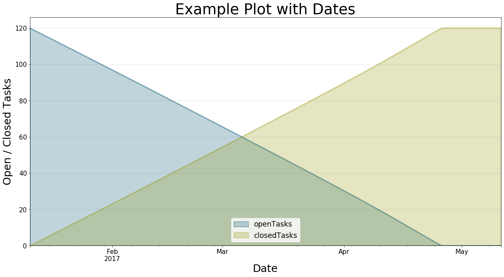
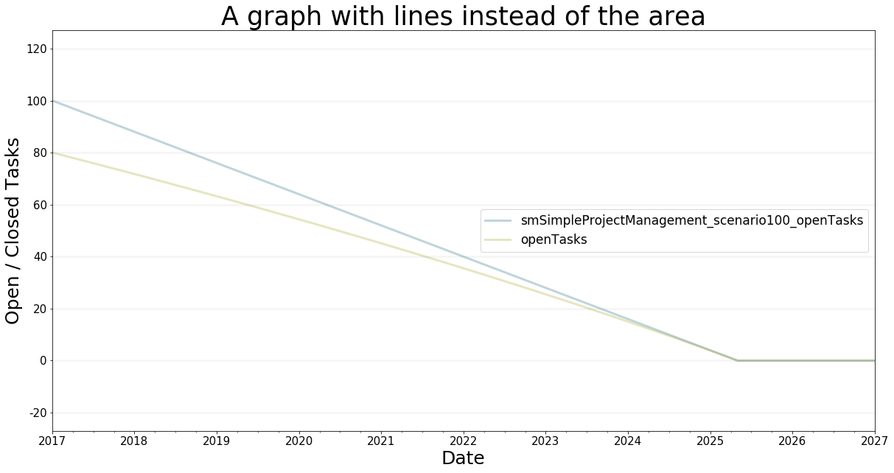

Advanced Plotting Features
==========================

.. meta::
   :description: Using advanced plotting features in the BPTK-Py simulation framework.
   :keywords: agent-based modeling, abm, bptk, bptk-py, python

Plotting Multiple Equations
---------------------------

Let's dive right in to the first the example. We may want to simulate
different equations for a specific simulation scenario.

We want to simulate the equation 'openTasks' and 'closedTasks' for the
scenario "scenario80". Play around with the parameters for the x/y
labels and title.

You may either use the ``scenario_managers`` parameter and supply a list
of all scenario Managers (by name) you want to plot the simulation
results for. Or you use the specific ``scenarios' names``. You may of
course as well use both if you have duplicate names (one name in
multiple scenario managers).

.. code:: ipython3

    from BPTK_Py.bptk import bptk
    bptk = bptk()
    
    
    bptk.plot_scenarios(
        scenario_managers=["smSimpleProjectManagement"],
        scenarios=["scenario80"],
        equations=['openTasks',"closedTasks"],
        title="Open and Closed Tasks",
        x_label="t",
        y_label="Open / Closed Tasks",
    )

Changing Start Date And Frequency
---------------------------------

In the above example, we did not specify the ``freq`` and ``start_date``
parameters. So the series just plots the values of t for the x axis.
Using the mentioned parameters you can generate time series data. Let us
set ``freq="M"``\ and ``start_date="1/11/2017"``. Of course, the graph
is the same. But the y-axis changed. Now the plot assumes daily data,
starting at Jan, 11, 2017!

.. code:: ipython3

    bptk.plot_scenarios(
        scenario_managers=["smSimpleProjectManagement"],
        scenarios=["scenario120"],
        equations=['openTasks',"closedTasks"],
        title="Example Plot with Dates",
        x_label="Date",
        y_label="Open / Closed Tasks",
        start_date="1/11/2017",
        freq="D"
    )

Renaming The Series
-------------------

The equation names are not the kind of names we want to show the
customer. So let use the ``series_names`` parameter to rename them.
Supply the equations to rename and their destination names. Use Python's
dict notation: ``{ equation_name : rename_to }``.

The dictionary serves as a set of replacement rules. To correctly rename
the series, you have to understand how the framework sets the names of
series to avoid ambiguity in series names. If you use more than one
scenario manager for plotting, bptk\_py will use the following series
naming schema: ``"scenarioManager"_"scenario"_"equation"``. If you want
to replace this, use
``series_names={"scenarioManager_scenario_equation": "new name"}``. You
may as well define a rule that replaces the name of each scenario
Manager with a whitespace. The number of rules is not limited.

Execute the following cell and see how we rename the series:

.. code:: ipython3

    bptk.plot_scenarios(
        scenario_managers=["smSimpleProjectManagement","anotherSimpleProjectManagement"],
        scenarios=["scenario80"],
        equations=['openTasks',"closedTasks"],
        title="Example Plot with dates, multiple scenario managers and renamed series \n and a very long headline",
        x_label="Date",
        y_label="Open / Closed Tasks",
        start_date="1/11/2017",
        freq="D",
        series_names={
            "anotherSimpleProjectManagement_scenario80_openTasks" : "Open Tasks another manager" ,
            "anotherSimpleProjectManagement_scenario80_closedTasks" : "Closed Tasks anoter Manager"}
    )

.. image:: output_6_0.png

**Hint**: Did you notice that you may use `\\n` to start a
new line in the headline? This may come in handy for long plot titles.

Changing The Kind Of Graph
--------------------------

You can change the kind of graph using the ``kind`` parameter! Let us
see what happens if we set ``kind="line"``!

.. code:: ipython3

    bptk.plot_scenarios(
        scenario_managers=["smSimpleProjectManagement"],
        scenarios=["scenario100","scenario80"],
        equations=["openTasks"],
        stacked=False, 
        freq="M", 
        start_date="1/11/2017",
        title="A graph with lines instead of the area",
        x_label="Date",
        y_label="Open / Closed Tasks",
        kind="line"
    )

