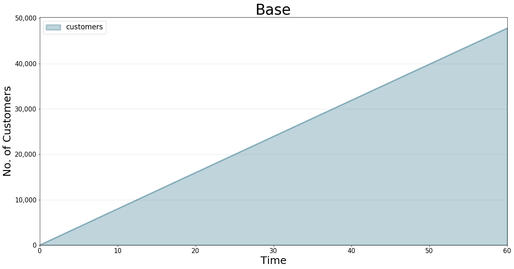
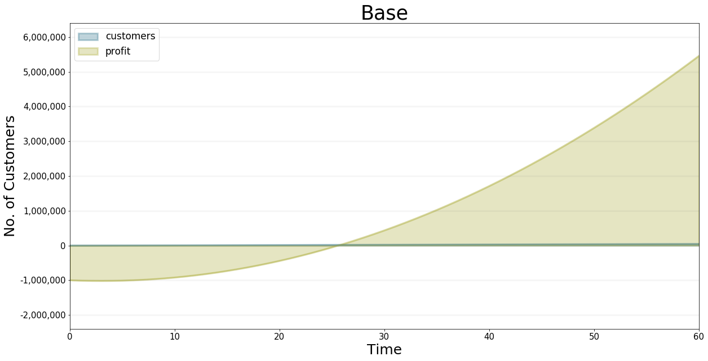
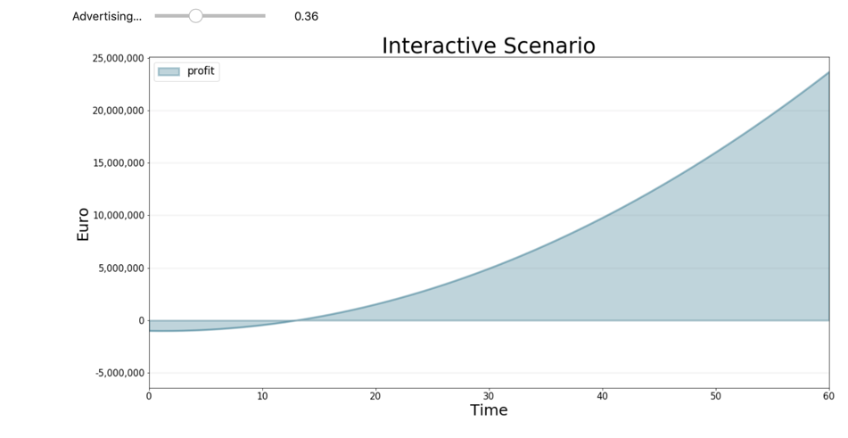

Developing Dashboards Using Jupyter Widgets
===========================================

.. meta::
   :description: Developing advanced user interfaces using the BPTK-Py business simulation framework.
   :keywords: agent-based modeling, abm, bptk, bptk-py, python, business simulation, Jupyter, Pandaas, Matplotlib

*Using Jupyter Widgets, Pandas Dataframes and Matplotlib to create advanced user interfaces.*

While BPTK-Py offers a number of high-level functions to quickly plot
equations (such as ``bptk.plot_scenarios``) or create a dashboard (e.g.
``bptk.dashboard``), you may sometimes be in a situation when you want
to create more sophisticated plots (e.g. plots with two axes) or a more
sophisticated interface dashboard for your simulation.

This is actually quite easy, because BPTK-Py's high-level functions
already utilize some very powerful open source libraries for data
management, plotting and dashboards: Pandas, Matplotlib and Jupyter
Widgets.

In order to harness the full power of these libraries, you only need to
understand how to make the data generated by BPTK-Py available to them.
This *How To* illustrates this using a neat little simulation of
customer acquisition strategies. You don't need to understand the
simulation to follow this document, but if you are interested you can
read more about it on our
`blog <https://www.transentis.com/an-example-to-illustrate-the-business-prototyping-methodology/>`__.

Advanced Plotting
-----------------

We'll start with some advanced plotting of simulation results.

.. code:: ipython3

    ## Load the BPTK Package
    from BPTK_Py.bptk import bptk 
    
    bptk = bptk()

BPTK-Py's workhorse for creating plots is the
``bptk.plot_scenarios``\ function. The function generates all the data
you would like to plot using the simulation defined by the scenario
manager and the settings defined by the scenarios. The data are stored
in a Pandas dataframe. When it comes to plotting the results, the
framework uses Matplotlib. To illustrate this, we will recreate the plot
below directly from the underlying data:

.. code:: ipython3

     bptk.plot_scenarios(
            scenario_managers=["smCustomerAcquisition"],
            scenarios=["base"], 
            equations=['customers'],
            title="Base",
            freq="M",
            x_label="Time",
            y_label="No. of Customers"
            )

You can access the data generated by a scenario by saving it into a
dataframe. You can do this by adding the ``return_df`` flag to
``bptk.plot_scenario``:

.. code:: ipython3

     df=bptk.plot_scenarios(
            scenario_managers=["smCustomerAcquisition"],
            scenarios=["base"], 
            equations=['customers'],
            title="Base",
            freq="M",
            x_label="Time",
            y_label="No. of Customers",
            return_df=True
            )

The dataframe is indexed by time and stores the equations (in SD models)
or agent properties (in Agent-based models) in the columns

.. code:: ipython3

    df[0:10] # just show the first ten items

.. raw:: html

    

    
    <table border="1" class="dataframe">
      <thead>
        <tr style="text-align: right;">
          <th></th>
          <th>customers</th>
        </tr>
        <tr>
          <th>t</th>
          <th></th>
        </tr>
      </thead>
      <tbody>
        <tr>
          <th>0</th>
          <td>0.000000</td>
        </tr>
        <tr>
          <th>1</th>
          <td>800.000000</td>
        </tr>
        <tr>
          <th>2</th>
          <td>1599.893333</td>
        </tr>
        <tr>
          <th>3</th>
          <td>2399.680014</td>
        </tr>
        <tr>
          <th>4</th>
          <td>3199.360057</td>
        </tr>
        <tr>
          <th>5</th>
          <td>3998.933476</td>
        </tr>
        <tr>
          <th>6</th>
          <td>4798.400284</td>
        </tr>
        <tr>
          <th>7</th>
          <td>5597.760498</td>
        </tr>
        <tr>
          <th>8</th>
          <td>6397.014130</td>
        </tr>
        <tr>
          <th>9</th>
          <td>7196.161194</td>
        </tr>
      </tbody>
    </table>
    

The frameworks ``bptk.plot_scenarios`` method first runs the simulation
using the setting defined in the scenario and stores the data in a
dataframe. It then plots the dataframe using Pandas ``df.plot``\ method.

We can do the same:

.. code:: ipython3

    subplot=df.plot(None,"customers")

.. image:: output_11_0.png

The plot above doesn't look quite as neat as the plots created by
``bptk.plot_scenarios``– this is because the framework applies some
styling information. The styling information is stored in
BPTK\_Py.config, and you can access (and modify) it there.

Now let's apply the config to ``df.plot``:

.. code:: ipython3

    import BPTK_Py.config as config
    
    subplot=df.plot(kind=config.configuration["kind"],
                           alpha=config.configuration["alpha"], stacked=config.configuration["stacked"],
                                                              figsize=config.configuration["figsize"],
                                                              title="Base",
                                                              color=config.configuration["colors"],
                                                              lw=config.configuration["linewidth"])

.. image:: output_13_0.png

Yes! We've recreated the plot from the high level
``btpk.plot_scenarios`` method using basic plotting functions.

Now let's do something that currently isn't possible using the
high-level BPTK-Py methods - let's create a graph that has two axes.

This is useful when you want to show the results of two equations at the
same time, but they have different orders of magnitudes. For instance in
the plot below, the number of customers is much smaller than the profit
made, so the customer graph looks like a straight line. But it would
still be intersting to be able to compare the two graphs.

.. code:: ipython3

     bptk.plot_scenarios(
            scenario_managers=["smCustomerAcquisition"],
            scenarios=["base"], 
            equations=['customers','profit'],
            title="Base",
            freq="M",
            x_label="Time",
            y_label="No. of Customers"
            )

As before, we collect the data in a dataframe.

.. code:: ipython3

     df=bptk.plot_scenarios(
            scenario_managers=["smCustomerAcquisition"],
            scenarios=["base"], 
            equations=['customers','profit'],
            title="Base",
            freq="M",
            x_label="Time",
            y_label="No. of Customers",
            return_df = True
            )

.. code:: ipython3

    df[0:10]

.. raw:: html

    

    
    <table border="1" class="dataframe">
      <thead>
        <tr style="text-align: right;">
          <th></th>
          <th>customers</th>
          <th>profit</th>
        </tr>
        <tr>
          <th>t</th>
          <th></th>
          <th></th>
        </tr>
      </thead>
      <tbody>
        <tr>
          <th>0</th>
          <td>0.000000</td>
          <td>-1.000000e+06</td>
        </tr>
        <tr>
          <th>1</th>
          <td>800.000000</td>
          <td>-1.010000e+06</td>
        </tr>
        <tr>
          <th>2</th>
          <td>1599.893333</td>
          <td>-1.016000e+06</td>
        </tr>
        <tr>
          <th>3</th>
          <td>2399.680014</td>
          <td>-1.018001e+06</td>
        </tr>
        <tr>
          <th>4</th>
          <td>3199.360057</td>
          <td>-1.016002e+06</td>
        </tr>
        <tr>
          <th>5</th>
          <td>3998.933476</td>
          <td>-1.010005e+06</td>
        </tr>
        <tr>
          <th>6</th>
          <td>4798.400284</td>
          <td>-1.000011e+06</td>
        </tr>
        <tr>
          <th>7</th>
          <td>5597.760498</td>
          <td>-9.860187e+05</td>
        </tr>
        <tr>
          <th>8</th>
          <td>6397.014130</td>
          <td>-9.680299e+05</td>
        </tr>
        <tr>
          <th>9</th>
          <td>7196.161194</td>
          <td>-9.460448e+05</td>
        </tr>
      </tbody>
    </table>
    

Plotting two axes is easy in Pandas (which itself uses the Matplotlib
library):

.. code:: ipython3

    ax = df.plot(None,'customers', kind=config.configuration["kind"],
                           alpha=config.configuration["alpha"], stacked=config.configuration["stacked"],
                                                              figsize=config.configuration["figsize"],
                                                              title="Profit vs. Customers",
                                                              color=config.configuration["colors"],
                                                              lw=config.configuration["linewidth"])
    # ax is a Matplotlib Axes object
    
    ax1 = ax.twinx()
    
    # Matplotlib.axes.Axes.twinx creates a twin y-axis.
    
    plot =df.plot(None,'profit',ax=ax1)

.. image:: output_20_0.png

Voila! This is actually quite easy one you understand how to access the
data (and of course a little knowledge of Pandas and Matplotlib is also
useful). If you were writing a document that needed a lot of plots of
this kind, you could create your own high-level function to avoide
having to copy and paste the code above multiple times.

Advanced Interactive User Interfaces
------------------------------------

Now let's try something a little more challenging: Let's build a
dashboard for our simulation that let's you manipulate some of the
scenrio settings interactively and plots results in tabs.

    Note: You need to have widgets enabled in Jupyter for the following
    to work. Please check the `BPTK-Py installation
    instructions <https://bptk.transentis-labs.com/en/latest/docs/usage/installation.html>`__
    or refer to the `Jupyter
    Widgets <https://ipywidgets.readthedocs.io/en/latest/user_install.html>`__
    documentation

First, we need to understand how to create tabs. For this we need to
import the ``ipywidget`` Library and we also need to access Matplotlib's
``pyplot``

.. code:: ipython3

    %matplotlib inline
    import matplotlib.pyplot as plt
    from ipywidgets import interact
    import ipywidgets as widgets

Then we can create some tabs that display scenario results as follows:

.. code:: ipython3

    out1 = widgets.Output()
    out2 = widgets.Output()
    
    tab = widgets.Tab(children = [out1, out2])
    tab.set_title(0, 'Customers')
    tab.set_title(1, 'Profit')
    display(tab)
    
    with out1:
        # turn of pyplot's interactive mode to ensure the plot is not created directly
        plt.ioff() 
        # create the plot, but don't show it yet
        bptk.plot_scenarios(
            scenario_managers=["smCustomerAcquisition"],
            scenarios=["hereWeGo"], 
            equations=['customers'],
            title="Here We Go",
            freq="M",
            x_label="Time",
            y_label="No. of Customers"
            )
        # show the plot
        plt.show()
        # turn interactive mode on again
        plt.ion()
    
    with out2:
        plt.ioff()
        bptk.plot_scenarios(
            scenario_managers=["smCustomerAcquisition"],
            scenarios=["hereWeGo"], 
            equations=['profit'],
            title="Here We Go",
            freq="M",
            x_label="Time",
            y_label="Euro"
            )
        plt.show()
        plt.ion()

.. parsed-literal::

    Tab(children=(Output(), Output()), _titles={'0': 'Customers', '1': 'Profit'})

That was easy! The only thing you really need to understand is to turn
interactive plotting in ``pyplot`` off before creating the tabs and then
turn it on again to create the plots. If you forget to do that, the
plots appear above the tabs (try it and see!).

In the next step, we need to add some sliders to manipulate the
following scenario settings:

-  Referrals
-  Referral Free Months
-  Referral Program Adoption %
-  Advertising Success %

Creating a slider for the referrals is easy using the integer slider
from the ``ipywidgets`` widget library:

.. code:: ipython3

    widgets.IntSlider(
        value=7,
        min=0,
        max=15,
        step=1,
        description='Referrals:',
        disabled=False,
        continuous_update=False,
        orientation='horizontal',
        readout=True,
        readout_format='d'
    )

.. parsed-literal::

    IntSlider(value=7, continuous_update=False, description='Referrals:', max=15)

When manipulating a simulation model, we mostly want to start with a
particular scenario and then manipulate some of the scenario settings
using interactive widgets. Let's set up a new scenario for this purpose
and call it ``interactiveScenario``:

.. code:: ipython3

    bptk.register_scenarios(scenario_manager="smCustomerAcquisition", scenarios=
                      {
                          "interactiveScenario":{
                              "constants":{
                                 "referrals":0,
                                  "advertisingSuccessPct":0.1,
                                  "referralFreeMonths":3,
                                  "referralProgamAdoptionPct":10
                                }
                          }
                    }
    )

We can then access the scenario using
``bptk.scenario_manager_factory.get_scenarios``:

.. code:: ipython3

    scenario = bptk.get_scenario("smCustomerAcquisition","interactiveScenario")
    scenario.constants

.. parsed-literal::

    {'referrals': 0,
     'advertisingSuccessPct': 0.1,
     'referralFreeMonths': 3,
     'referralProgamAdoptionPct': 10}

.. code:: ipython3

    bptk.plot_scenarios(scenario_managers=["smCustomerAcquisition"],
            scenarios=["interactiveScenario"], 
            equations=['profit'],
            title="Interactive Scenario",
            freq="M",
            x_label="Time",
            y_label="Euro"
            )

.. image:: output_36_0.png

The scenario constants can be accessed in the constants variable:

Now we have all the right pieces, we can put them together using the
interact function.

.. code:: ipython3

    @interact(advertising_success_pct=widgets.FloatSlider(
        value=0.1,
        min=0,
        max=1,
        step=0.01,
        continuous_update=False,
        description='Advertising Success Pct'
    ))
    def dashboard(advertising_success_pct):
        scenario= bptk.get_scenario("smCustomerAcquisition","interactiveScenario")
        
        scenario.constants["advertisingSuccessPct"]=advertising_success_pct
        bptk.reset_scenario_cache(scenario_manager="smCustomerAcquisition",
                                                                 scenario="interactiveScenario")
        bptk.plot_scenarios(scenario_managers=["smCustomerAcquisition"],
            scenarios=["interactiveScenario"], 
            equations=['profit'],
            title="Interactive Scenario",
            freq="M",
            x_label="Time",
            y_label="Euro"
            )

Now let's combine this with the tabs from above.

.. code:: ipython3

    out1 = widgets.Output()
    out2 = widgets.Output()
    
    
    tab = widgets.Tab(children = [out1, out2])
    tab.set_title(0, 'Customers')
    tab.set_title(1, 'Profit')
    display(tab)
        
    @interact(advertising_success_pct=widgets.FloatSlider(
        value=0.1,
        min=0,
        max=10,
        step=0.01,
        continuous_update=False,
        description='Advertising Success Pct'
    ))
    def dashboardWithTabs(advertising_success_pct):
        scenario= bptk.get_scenario("smCustomerAcquisition","interactiveScenario")
        
        scenario.constants["advertisingSuccessPct"]=advertising_success_pct
        bptk.reset_scenario_cache(scenario_manager="smCustomerAcquisition",
                                                                 scenario="interactiveScenario")
       
       
         
        with out1:
            # turn of pyplot's interactive mode to ensure the plot is not created directly
            plt.ioff() 
            # clear the widgets output ... otherwise we will end up with a long list of plots, one for each change of settings
            
            # create the plot, but don't show it yet
            bptk.plot_scenarios(
                scenario_managers=["smCustomerAcquisition"],
                scenarios=["interactiveScenario"], 
                equations=['customers'],
                title="Interactive Scenario",
                freq="M",
                x_label="Time",
                y_label="No. of Customers"
                )
            # show the plot
            out1.clear_output() 
            plt.show()
            # turn interactive mode on again
            plt.ion()
    
        with out2:
            plt.ioff()
            out2.clear_output()
            bptk.plot_scenarios(
                scenario_managers=["smCustomerAcquisition"],
                scenarios=["interactiveScenario"], 
                equations=['profit'],
                title="Interactive Scenario",
                freq="M",
                x_label="Time",
                y_label="Euro"
                )
            plt.show()
            plt.ion()

.. image:: dashboard_with_tabs.png

