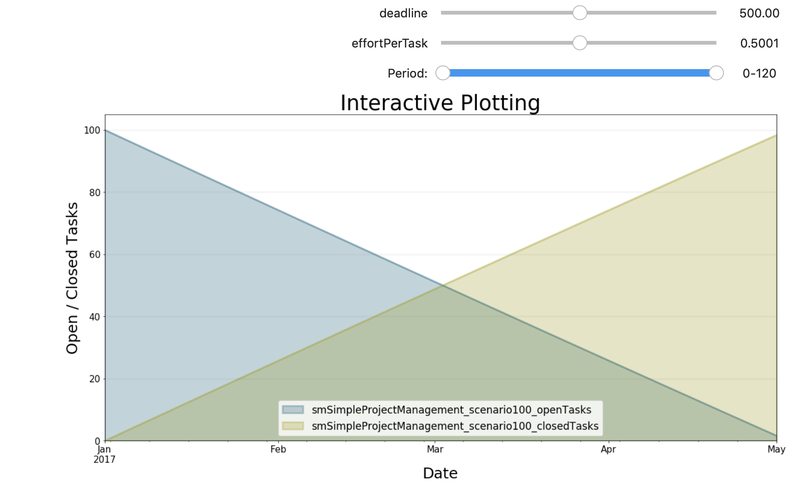
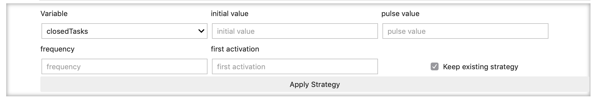

Building Interactive Dashboards
===============================

.. meta::
   :description: Building interactive dashboards using the BPTK-Py business simulation framework.
   :keywords: agent-based modeling, abm, bptk, bptk-py, python, business simulation, dashboard

An important part of modelling is to modify values on-the-fly,
interactively with the customer. The API function ``bptk.dashboard`` has
this functionality. It comes with a field "constants" that contains a
list of widget definitions. Each widget is defined using a tuple. The
structure is:
``("widget_type","name.of.constant",start_value,maximum_value)``. This
allows you to see the results of the simulations instantly without
having to re-run the simulation manually. See a working example in the
following plot.

Widgets That Are Currently Supported
------------------------------------

Currently, BPTK-Py supports the following widgets: \* **sliders**:
Sliders allow you to select a value in an interval. Use "slider" as
``widget_type``. A slider requires ``start_value and maximum_value``.
You may use one more value to specify the step size of the slider as a
floating point number (optional). If not specified, the slider will use
a precision of two decimal places (0.1). Example:
``("slider",'initialOpenTasks',100.0,1000.0,0.01)``. \* **checkbox**: If
you want a checkbox, use "checkbox" as ``widget_type``. You do not have
to supply ``start_value / maximum_value``. Example:
``("checkbox","initialStaff")`` \* **timerange**: This will give you a
slider in which you can select time intervals within the graph to "zoom
in/out" of certain parts of the graph. It gives you the power to further
look into certain simulation periods. It is enough to just add the
keyword "timerange" as ``widget_type``.

Using Widgets To Modify A Model
-------------------------------

It is important to mention that everytime you move a slider/checkbox,
the underlying model equations are modified. This means, the results of
the scenario will also deviate in other plots of the same scenario. You
may reuse the modifications to the model in further plots. If this is
not what you want, a quick workaround is to initiliaze another instance
of BPTK\_Py and run the ``dashboard`` function independently from the
other instance(s).

.. code:: ipython3

    from BPTK_Py.bptk import bptk
    bptk = bptk()
    bptk.dashboard(scenario_managers=["smSimpleProjectManagement"],
                                    scenarios=["scenario100"],
                                    kind="area",
                                    equations=["openTasks","closedTasks"],
                                    stacked=False,
                                    strategy=False,
                                    freq="D",
                                    start_date="1/1/2017",
                                    title="Interactive Plotting",
                                    x_label="Date",
                                    y_label="Open / Closed Tasks",
                                    constants=[
                                        ("slider",'deadline',0.0,1000.0),
                                        ("slider","effortPerTask",0.0001,1.0,0.0001),("timerange")]
                                    )

Using PULSE Functions
---------------------

A PULSE function sets a variable to a specified value for exactly one
step in the situation. This is useful for simulating regular actions
like a TV campaign in every 4th week of the simulation.

To create the widget, use the
``pulse_function_create(scenario_managers=[...],scenarios=[...]``
function! By now, you should be familiar with the notation :-)

The image above shows how to use the feature. First, select the variable
you would like to apply the PULSE function to. Then configure the
initial value. This value is the standard value that is active
throughout all periods apart from the pulse moments. In the example it
is 100. Next, we configure the value for the pulse periods, here 200.
The other settings are the frequency (10) and the first time the
function triggers.

If you deactivate the checkbox "Keep existing strategy", all previously
created PULSE functions will be deleted and only the **one** you create
now, will be stored.

The function in the example sets ``deadline`` to 1 for t=10, 20, 30 and
so on.

You may also define multiple PULSE functions for variables. After
defining the functions, you can plot the scenario(s) using the
``plot_scenarios`` function. Note that for plotting, we use the
``strategy`` flag as we only modify the execution strategy. More on
strategies in the following section.

Try out yourself:

**Note:** To avoid interference of model changes with the main instance
of BPTK\_PY, we instantiate another one named ``bptk_pulse``.

.. code:: ipython3

    import BPTK_Py
    bptk_pulse = BPTK_Py.bptk()
    bptk_pulse.pulse_function_create(scenarios=["scenario100","scenario80"],
                                     scenario_managers=["smSimpleProjectManagement"])

.. code:: ipython3

    bptk_pulse.plot_scenarios(scenarios=["scenario80"],
                        strategy=True,
                        scenario_managers=["smSimpleProjectManagement"],
                        equations=["deadline"]
                        )

.. image:: output_6_0.png

