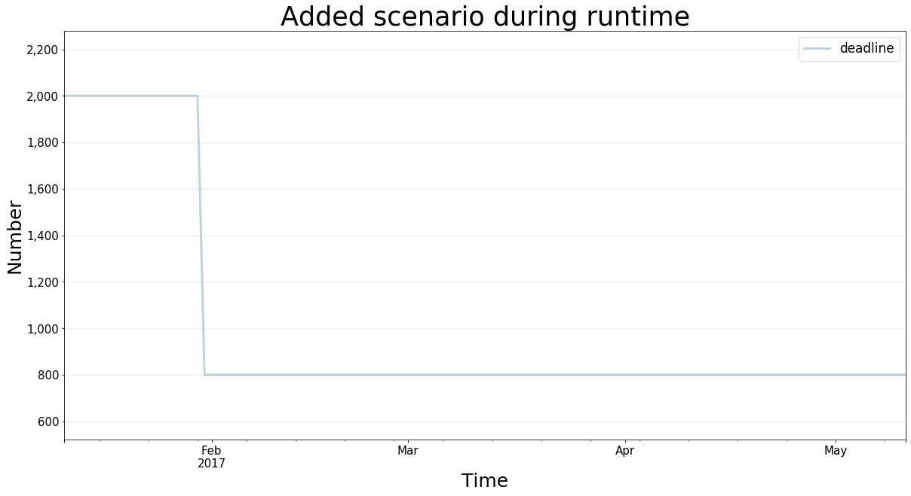

Scenarios In Depth
==================

.. meta::
   :description: In depth description of scenario management in the BPTK-Py business simulation framework, as it applies to Agent-based modeling and System Dynamics.
   :keywords: agent-based modeling, abm, bptk, bptk-py, python, business simulation

Scenarios are the heart of each simulation. A scenario defines which
simulation model to use, optionally points to a source model and has a
name. It may override model constants and define execution strategies.

Understanding The Scenario Definition Format
--------------------------------------------

The latter change constants in different steps of the simulation. See
the "strategy simulation" section for details. You write scenarios in
`JSON format <http://www.json.org>`__. The default location to store
scenarios is the ``scenarios`` subfolder of your current working
directory, you can change this value in the config file.

We group simulation scenarios by "scenario Managers". One scenario
manager encapsulates one simulation model and has a name. Scenarios run
this simulation model and modify constants. One JSON file may contain
more than one scenario manager. A simple example with one scenario
manager will look like this:

::

    {  
        "smSimpleProjectManagement":{
        "source":"simulation_models/sd_simple_project.itmx",
        "model":"simulation_models/sd_simple_project",
        "base_constants": {
              "deadline": 100,
              "effortPerTask": 1,
              "initialOpenTasks": 80,
              "initialStaff": 1
        },
        "base_points": {
            "productivity" : [
            [0,0.4],
            [0.25,0.444],
            [0.5,0.506],
            [0.75,0.594],
            [1,1],
            [1.25,1.119],
            [1.5,1.1625],
            [1.75,1.2125],
            [2,1.2375],
            [2.25,1.245],
            [2.5,1.25]
            ]
        },
        "scenarios": {
          "base": {
          },
          "scenario100": {
            "constants": {
              "initialOpenTasks": 100
            }
          },
          "scenario80": {
            "constants": {
            }
          },
          "scenario120": {
            "constants": {
              "initialOpenTasks": 120
            },
            "strategy": {
              "20": {
                "deadline": 120
              }
            }
          }
        }
     }
    }

We start with the name of the scenario manager's name under which we all
its scenarios. If you use the same name for a scenario manager in
another file, this will be detected and the scenario will be added to
the scenario manager. The scenario manager stores the model (source file
and python file) as well as all scenarios that belong to it. The
``model`` parameter contains the (relative) path to the (python)
simulation model. If using a relative path, keep in mind that
``BPTK_Py`` looks for the file from your current working directory, i.e.
the path of your script or jupyter notebook.

Then the key ``base_constants`` may follow. It defines the initial state
for all models, regardless the state in the model source file. Here you
can set all constants to a desired state. Each scenario stores the same
values for the given constants. For example, in this example we set
"initialOpenTasks" to 80. In this case, define ``base_constants`` for
the scenario manager in exactly one file, not in multiple. In case the
base constants stretch over multiple files, ``bptk_py`` attempts to
merge them and data loss may occur due to duplicate values for the same
constants. For defining an initial state of the graphical functions we
employ ``base_points``. The schema is the same: define the points that
are valid for all scenarios unless the ones that override them.

The actual scenarios follow after the ``scenarios`` tag. If you define
scenarios for one scenario manager over multiple files, this is O.K. and
increases readability for the user. For each scenario, you have to
supply a unique name as well. JSON does not support integer keys. The
``constants`` list stores the overrides constants. The constants
override certain base constants given before. The scenario "base" sets
"initialOpenTasks" to 100. This value is only valid for this specific
scenario. The other values such as "deadline" stay the same as the base
constants, as there is no overrid. "scenario80" does not override any
constants and hence use all base constants. You may either define
numerical values such as ``0.5`` or use strings to define expressions
such as ``"5/10"``\ which will be evaluated to ``0.5`` by the framework.

You should consider using the ``source`` field in the scenario manager
tag. It specifies the (relative) path to the original model file of 3rd
party applications. For now, the framework supports automatic conversion
of .itmx/.stmx files from Stella Architect. For each source file, a file
monitor will run in background to check for changes in the source model.
The file monitor will automatically update the python model file
whenever a change to the source model is detected.

Creating Scenarios During Runtime
---------------------------------

It is possible to add scenarios during runtime. For convenience, here is
some example code you may use as a template to generate your own
scenarios during runtime. If you define multiple scenarios for the same
``scenario_manager``, this is no problem.

First define the details for the scenario manager and then set up the
name of the scenario, the strategy and the constants. The strategy may
as well be one of the complex ones as described above. But be careful to
define everything correctly. We plan to develop a tool to help you
create scenarios a little easier.

.. code:: ipython3

    import BPTK_Py
    bptk = BPTK_Py.bptk()
    
    scenario_manager={
        "smSimpleProject_temp":
        {
            "source": "simulation_models/sd_simple_project.itmx",
            "model": "simulation_models/sd_simple_project"
        }
    }
    scenario_name = "scenario160"
    
    strategy = {
                "0": {
                    "deadline" : 2000
                } ,
                "20":{
                    "deadline" : 800
                }
    }
    
    constants = {
                "deadline" : 160,
                "effortPerTask" : 0.1
            }
    
    
    scenario_dictionary ={
                     scenario_name:{
                         "constants" : constants, 
                         "strategy" : strategy
                     } 
                 } 
                
    
    bptk.register_scenario_manager(scenario_manager)
    bptk.register_scenarios(scenario_manager="smSimpleProject_temp",scenarios=scenario_dictionary)
    

.. code:: ipython3

    bptk.list_scenarios(scenario_managers=["smSimpleProject_temp"])

.. parsed-literal::

    
    *** smSimpleProject_temp ***
    	 scenario160

.. code:: ipython3

    bptk.plot_scenarios(
        scenario_managers=["smSimpleProject_temp"],
        scenarios=["scenario160"],
        kind="line",
        equations=["deadline"],
        stacked=False, 
        strategy=True,
        freq="D", 
        start_date="1/11/2017",
        title="Added scenario during runtime",
        x_label="Time",
        y_label="Number",
    )

You can also register a scenario manger along with some scenarios
directly:

.. code:: ipython3

    scenario_manager={
        "smSimpleProject_another_temp":
        {
            "source": "simulation_models/sd_simple_project.itmx",
            "model": "simulation_models/sd_simple_project",
            "scenarios":{
                "scenario160":{
                    "constants":{
                        "deadline" : 160,
                        "effortPerTask" : 0.1
                    },
                    "strategy":{
                        "0": {
                            "deadline" : 2000
                        },
                        "20":{
                            "deadline" : 800
                        }
                    }
                }
            }
        }
    }
    
    
    bptk.register_scenario_manager(scenario_manager)

.. code:: ipython3

    bptk.list_scenarios(scenario_managers=["smSimpleProject_temp","smSimpleProject_another_temp"])

.. parsed-literal::

    
    *** smSimpleProject_temp ***
    	 scenario160
    
    *** smSimpleProject_another_temp ***
    	 scenario160

.. code:: ipython3

    bptk.plot_scenarios(
        scenario_managers=["smSimpleProject_another_temp"],
        scenarios=["scenario160"],
        kind="line",
        equations=["deadline"],
        stacked=False, 
        strategy=True,
        freq="D", 
        start_date="1/11/2017",
        title="Added another scenario during runtime",
        x_label="Time",
        y_label="Number",
    )

.. image:: output_8_0.png

Resetting Scenarios
-------------------

After a while of simulating, modifying strategies, constants and
generating beautiful plots, you may realize that you want to go back and
reset the simulation. For this purpose, you have three methods
available: \* ``reset_scenario(scenario_manager, scenario)``: This
deletes a specific scenario from memory and reloads it from file.
Requires the scenario manager's name and the scenario name. \*
``reset_all_scenarios()``: Reset all scenarios and re-read from file \*
``reset_scenario_cache(scenario_manager, scenario="")``: For runtime
optimizations, the simulator will cache the simulation results. In some
rare cases, this cache may not be flushed upon scenario modification.
Hence, this method resets the simulation model's cache.

See the example usages below:

.. code:: ipython3

    bptk.reset_scenario(scenario_manager="smSimpleProjectManagement",scenario="scenario80")
    
    bptk.reset_all_scenarios()
    
    bptk.reset_scenario_cache("smSimpleProjectManagement","scenario80")

Defining Simulation Strategies
------------------------------

The simulator is also able to simulate various execution strategies. A
strategy defines which constants change at which point in time of the
simulation. For defining a strategy, use the ``strategy`` key in your
scenario definition and give (key,value) sets for the constants you'd
like to change. Note that the ``constants`` field in the strategy will
also be parsed at ``t=0`` for initial modifications of the strategies.

::

      "strategy": {
        "20": {
          "deadline" : 120
        }
      }

This strategy reduces the deadline for the project to 120 at the 20th
period. The full scenario for this strategy is available in
`scenarios/intro.json <https://github.com/transentis/bptk_py_tutorial/blob/master/scenarios/intro.json>`__
in the scenario "scenario120". To apply a strategy for a scenario, use
the parameter ``strategy=True``.Keep in mind that if you defined a
strategy in the JSON file and set ``strategy=True`` in the dashboard
method, this overrides the sliders in interactive plotting from the
point of the first time of the strategy execution.For instance if you
define a slider for "deadline", the slider's modification will only have
an effect until t=19, as from t=20 the strategy modifies "deadline".

The following plot executes the model with the strategy and shows how
the marketing budget follows the configuration the strategy.

**Note:** If you set the ``strategy=True`` but there is not strategy
defined in the scenario, the simulator will just issue a Warning in the
logfile and execute the simulation(s) without a strategy.

The following example shows what happens when using the strategy as
compared to the scenario without strategy:

.. code:: ipython3

    from BPTK_Py.bptk import bptk
    bptk = bptk()
    bptk.plot_scenarios(
        scenario_managers=["smSimpleProjectManagement"],
        scenarios=["scenario120"], 
        equations=["deadline"],
        title="Deadline changes",
        x_label="Time",
        y_label="Marketing Budget (USD)",
        strategy=True, kind="line"
    )

.. image:: output_12_0.png

