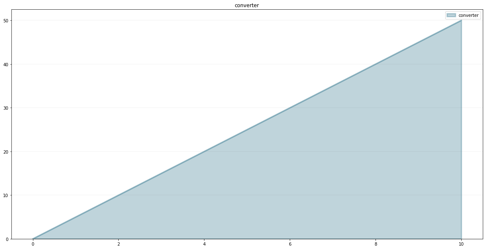
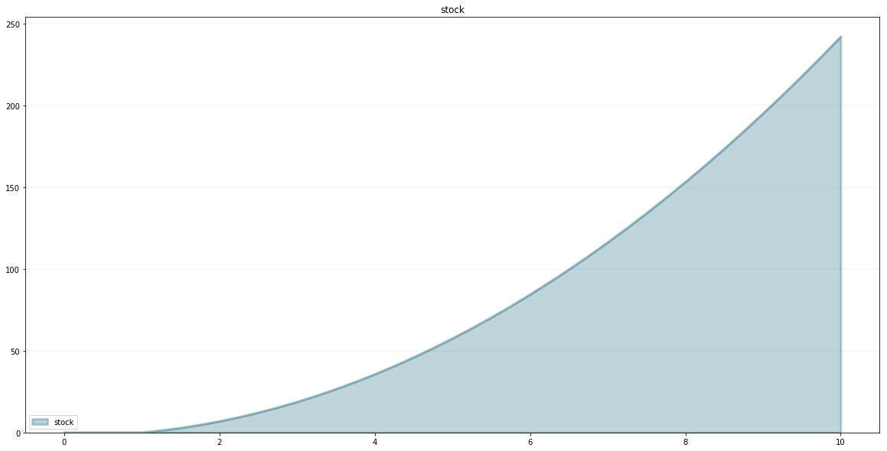
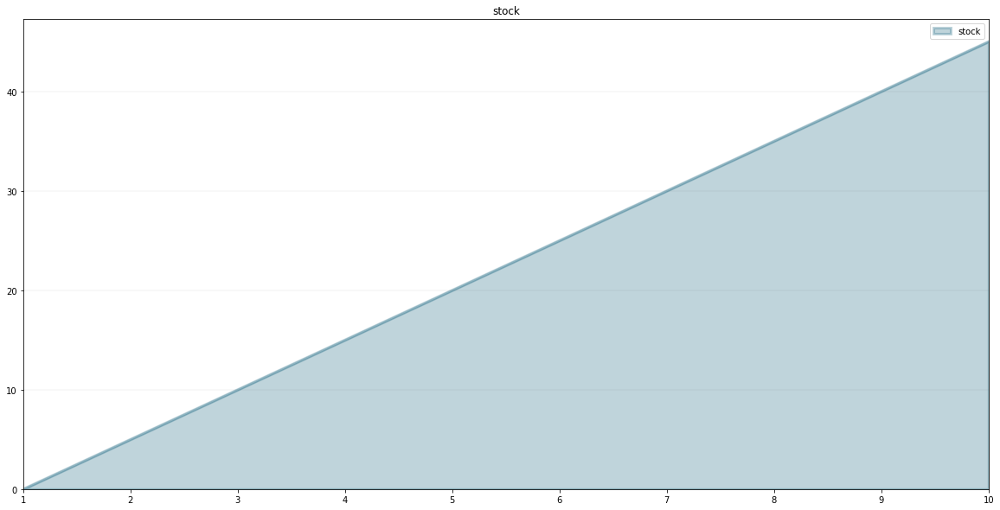
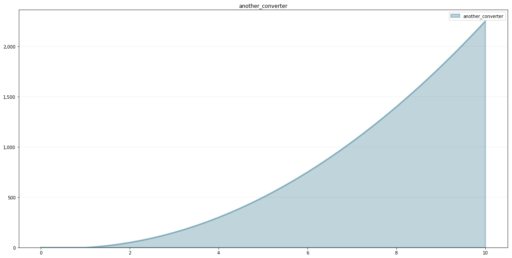

****************************************************
How To: Creating User-defined Functions in SD Models
****************************************************

One of the benefits of creating System Dynamics models in Python is that
we can use the full power of Python to create our own functions, which
we can then use in our models.

This how to illustrates how to do this.

First of all, lets set up our model:

.. code:: ipython3

    from BPTK_Py import Model
    from BPTK_Py import sd_functions as sd

.. code:: ipython3

    model = Model(starttime=1,stoptime=10,dt=0.25,name='Test Model')

Now let's define a function we would like to use in our model. A user
defined function can have as many arguments as you like, but it must
accept at least a model and time parameter (you don't need to use the
parameters if you don't want to).

How you define your function is up to you - you can use any of the
methods available in Python, such as class methods, using def, or lambda
functions.

The example below uses a lambda function which simply multiplies the
current time ``t`` with 5.

.. code:: ipython3

    my_model_function = model.function("my_model_function", lambda model, t: 5*t)

As you can see, much like with stocks and converters, we associate our
function with the model by calling the models ``function``\ method.

Next we set up a converter:

.. code:: ipython3

    converter = model.converter("converter")

The converters equation calls the model function.

.. code:: ipython3

    converter.equation = my_model_function()

We can test the function as follows:

.. code:: ipython3

    model.evaluate_equation("converter",5)

.. parsed-literal::

    25

Let's plot the function over time:

.. code:: ipython3

    converter.plot()

We can also create a stock that has the converter as an inflow:

.. code:: ipython3

    stock = model.stock("stock")

.. code:: ipython3

    stock.equation = converter

.. code:: ipython3

    stock.plot()

We can do all the usual arithmethic:

.. code:: ipython3

    stock.equation=converter/(sd.time())

.. code:: ipython3

    stock.plot()

The function we created above was just dependent on time and not on
other model variables. Let's create a function that takes more
argmuments, e.g. one that multiplies a model variable with time.

You can add as many arguments as you like, but they must come after the
``model`` and ``t`` arguments.

.. code:: ipython3

    another_model_function = model.function("another_model_function", lambda model, t, element: 5*t*element)

Define a new converter which will be the input for the function:

.. code:: ipython3

    input_converter = model.converter("input_converter")

.. code:: ipython3

    input_converter.equation= stock

Now add a converter which will apply the ``another_model_function``:

.. code:: ipython3

    another_converter = model.converter("another_converter")

.. code:: ipython3

    another_converter.equation=another_model_function(input_converter)

.. code:: ipython3

    another_converter.plot()

