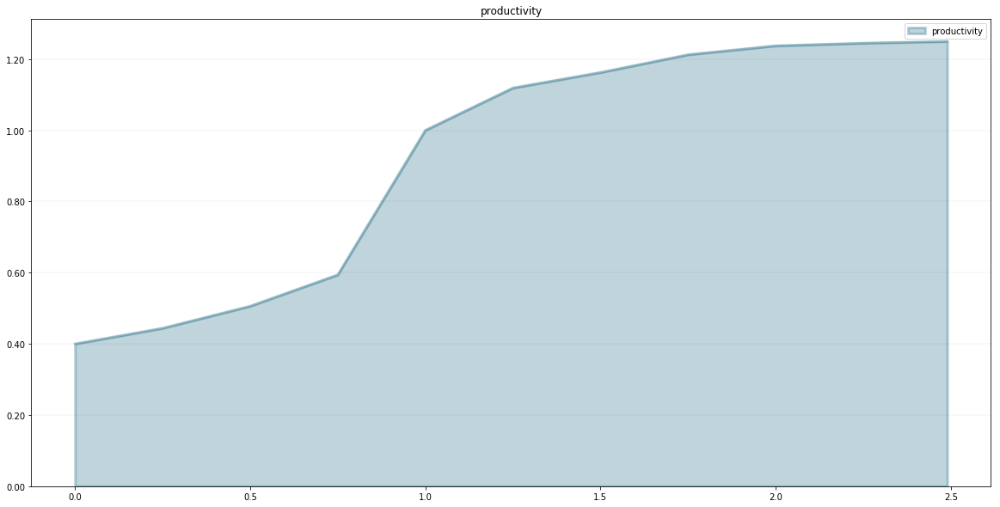
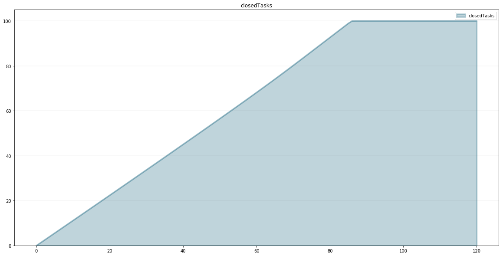
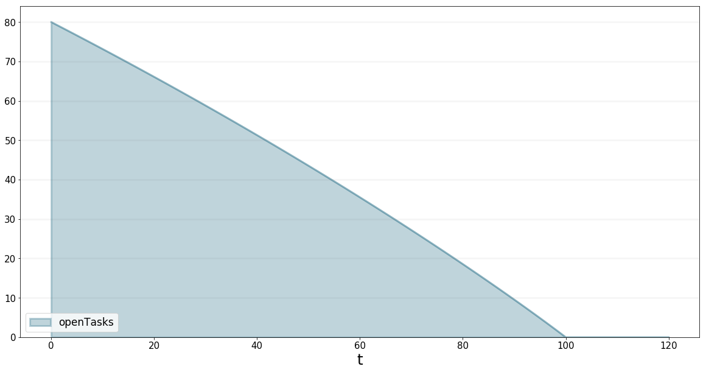
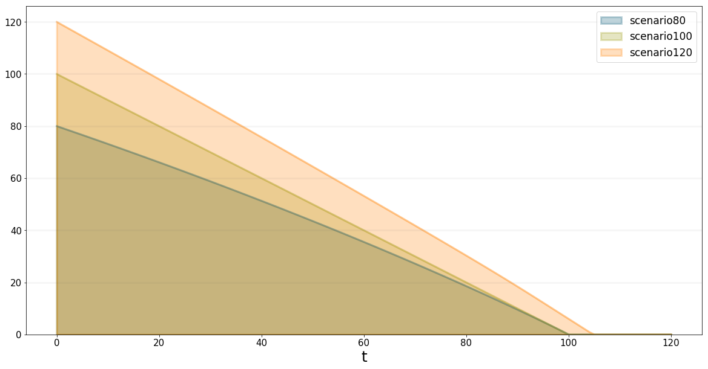

*******************************************
A Simple Python Library For System Dynamics
*******************************************

**Build System Dynamics simulations interactively in Jupyter using Python**

We love building computational models and our favorite environment for
this kind of explorative, analytical work are
`Jupyter <http://www.jupyter.org>`__ and
`Python <http://www.python.org>`__.

To make computational modeling easier we are developing the *Business
Prototyping Toolkit for Python* (BPTK PY), a simple library that
currently supports System Dynamics and Agent-based modeling.

We first introduced the BPTK PY libary in our blog post `Writing
Computational Essays Based On Simulation
Models <https://www.transentis.com/writing-computational-essays-based-simulation-models/>`__.

Since then we've created some new functionality that allows you to build
System Dynamics models and Agent-based models interactively in Jupyter
using Python. To make model building as simple as possible, we have
created a simple, domain-specific language (DSL) that supports both
System Dynamics and Agent-based modeling and hides much of the
underlying complexity of computational models.

This language not only allows you to create System Dynamics models and
Agent-based models, you can even mix the two to create "hybrid"
simulation models.

Having such a DSL is useful for several reasons:

-  Build models interactively in Jupyter, making the modeling process
   very effective.
-  Python novices can focus on the modeling, without needing to know
   much about Python
-  Python experts can mix their models with other analytical frameworks,
   e.g. machine-learning toolkits.

Needless to say the new functionality seamlessly integrates with the
rest of the BPTK PY framework, so you can use all the high-level
scenario management and plotting functions which are part of the
framework.

In this post I focus on how to build a System Dynamics model using the
framework, I will take a look at Agent-based modeling in a future post.

The post is also available as a Jupyter notebook in our BPTK PY
Tutorial, which is available for `download
here <https://www.transentis.com/products/business-prototyping-toolkit/>`__.

A simple model to demonstrate the library
=========================================

To illustrate the DSL, we will build the simple project management model
we introduced in our `step-by-step tutorial on System
Dynamics <https://www.transentis.com/step-by-step-tutorials/introduction-to-system-dynamics/>`__.

The project management model is really simple and just containts a few
stocks, flows and converters, as you can see in the following diagram:

.. figure:: simple_project_diagram.png
   :alt: Diagram of the Simple Project Management Model

   Diagram of the Simple Project Management Model

So even if you don't know the model you should be able to follow this
post very easily.

To get started, we first need to import the library and in particular
the SD function library into our notebook.

.. code:: ipython3

    from BPTK_Py import Model
    from BPTK_Py import sd_functions as sd

The SD function library contains the functions and operators needed to
define model equations (these are the built-ins you will know from your
visual modeling environment, such as Stella or Vensim). Because the
library contains functions such as ``min`` and ``max``, which are also
part of the Python standard library, we import the SD function library
with the prefix ``sd`` to avoid naming conflicts.

Next we create a model using the ``Model`` class. Our model will contain
all our model elements such as stocks, flows, converters and constants.

.. code:: ipython3

    model = Model(starttime=0,stoptime=120,dt=1,name='SimpleProjectManagament')

Creating model elements is really easy:

.. code:: ipython3

    openTasks = model.stock("openTasks")

As you can see our convention is to use the camel casing naming
convention for the model elements and to create Python variables for the
elements that carry the same name.

Once a model element has been defined in this manner, we only need to
refer to the Python variable and don't need to reference the model
element (i.e. we can use ``openTasks`` in our equations, as opposed to
using ``model.stock("openTasks")``. This saves a lot of typing.

Let's define the other model elements and variables now too, so that we
can then concentrate on the equations:

.. code:: ipython3

    closedTasks = model.stock("closedTasks")
    staff = model.stock("staff")
    completionRate = model.flow("completionRate")
    currentTime = model.converter("currentTime")
    remainingTime = model.converter("remainingTime")
    schedulePressure = model.converter("schedulePressure")
    productivity = model.converter("productivity")
    deadline = model.constant("deadline")
    effortPerTask = model.constant("effortPerTask")
    initialStaff = model.constant("initialStaff")
    initialOpenTasks = model.constant("initialOpenTasks")

Note that in our models we differentiate between *constants* and
*converters* – this isn't strictly necessary from a System Dynamics
point of view, but it makes it easier to check the model for errors.

Now let's initialize our stocks - to do this, we just need to set the
``initial_value`` property of the stocks. The initial value can either
be a numerical constant or a constant element.

.. code:: ipython3

    closedTasks.initial_value = 0
    staff.initial_value = initialStaff
    openTasks.initial_value = initialOpenTasks 

Defining the model equations is really easy: each model variable has an
``equation`` property, the equation itself is written much like you
would in a visual modeling environment, using the other model variables
as necessary.

Defining constants is particularly easy:

.. code:: ipython3

    deadline.equation = 100
    effortPerTask.equation = 1
    initialStaff.equation = 1
    initialOpenTasks.equation = 100

The ``currentTime`` variable tracks the simulation time, which is
captured by the ``time`` function in the SD function library.

.. code:: ipython3

    currentTime.equation=sd.time()

The ``remainingTime`` equals the difference between the ``deadline`` and
the ``currentTime``:

.. code:: ipython3

    remainingTime.equation = deadline - currentTime

So you see, thanks to the DSL defining equations is very intuitive!

The equations for the stocks are also really simple - they just contain
the inflows (with a positive sign) and the outflows (with a negative
sign).

A quick look at the diagram above tells us that the ``openTasks`` only
have an outflow (defined by the ``completionRate``) and the
``closedTasks`` only have an inflow (also defined by the
``completionRate``):

.. code:: ipython3

    openTasks.equation = -completionRate

.. code:: ipython3

    closedTasks.equation = completionRate

The ``schedulePressure`` is a dimensionless ratio that compares the
required effort to complete all remaining open tasks to the remaining
work capacity.

We use the ``min`` and ``max`` functions from the SD function library to
ensure that no division by zero occurs and that the schedule pressure is
capped at 2.5:

.. code:: ipython3

    schedulePressure.equation = sd.min((openTasks*effortPerTask)/(staff*sd.max(remainingTime,1)),2.5)

We define the productivity in our model using a non-linear relationship
(depending on the schedule pressure). We capture this relationship in a
lookup table that we store in the ``points`` property of the model
(using a Python list):

.. code:: ipython3

    model.points["productivity"] = [
        [0,0.4],
        [0.25,0.444],
        [0.5,0.506],
        [0.75,0.594],
        [1,1],
        [1.25,1.119],
        [1.5,1.1625],
        [1.75,1.2125],
        [2,1.2375],
        [2.25,1.245],
        [2.5,1.25]
    ]

We can easily plot the lookup table to see whether it has the right
shape:

.. code:: ipython3

    model.plot_lookup("productivity")

The productivity equation is then defined via a lookup function – in our
case ``productivity`` depends non-linearly on ``schedulePressure`` as
defined in the lookup table:

.. code:: ipython3

    productivity.equation = sd.lookup(schedulePressure,"productivity")

The last equation we need to define is that of the ``completionRate`` -
the completion rate is defined by the number of staff working on the
project divided by the effort per task. We then multiply this with the
(average) productivity of the staff. The completion rate may never be
larger than the number of ``openTasks``, so we constrain it using the
``min`` function.

.. code:: ipython3

    completionRate.equation = sd.max(0, sd.min(openTasks, staff*(productivity/effortPerTask)))

Now that we have defined all necessary equations, we are ready to run
the model. The easist way is to evaluate a model variable at a
particular timestep - this approach is particularly useful if you are
building the model interactively (e.g. in a Jupyter notebook) and you
want to test intermediate results.

.. code:: ipython3

    closedTasks(80), closedTasks(100), closedTasks(120)

.. parsed-literal::

    (80.0, 100.0, 100.0)

Let's play with different settings for the deadline:

.. code:: ipython3

    deadline.equation = 120

.. code:: ipython3

    closedTasks(80), closedTasks(100), closedTasks(120)

.. parsed-literal::

    (63.33020661244643, 81.06644489208418, 99.99777243819346)

.. code:: ipython3

    deadline.equation=80

.. code:: ipython3

    closedTasks(80), closedTasks(100), closedTasks(120)

.. parsed-literal::

    (92.6853060260874, 100.00000000000004, 100.00000000000004)

Of course we can also plot the variables in a graph straight away using
the element's ``plot()`` method.

.. code:: ipython3

    closedTasks.plot()

Now that we have a model, we can use the powerful scenario management
built into the BPTK PY framework.

To do that, we first need to instantiate the framework:

.. code:: ipython3

    import BPTK_Py
    bptk = BPTK_Py.bptk()

Then we set up a scenario manager using a Python dictionary. The
scenario manager identifies the baseline constants of the model:

.. code:: ipython3

    scenario_manager = {
        "smSimpleProjectManagementDSL":{
        
        "model": model,
        "base_constants": {
            "deadline": 100,
            "initialStaff": 1,
            "effortPerTask": 1,
            "initialOpenTasks": 100,
    
        },
        "base_points":{
                "productivity": [
                    [0,0.4],
                    [0.25,0.444],
                    [0.5,0.506],
                    [0.75,0.594],
                    [1,1],
                    [1.25,1.119],
                    [1.5,1.1625],
                    [1.75,1.2125],
                    [2,1.2375],
                    [2.25,1.245],
                    [2.5,1.25]
                ]
        }
     }
    }

The scenario manager has to be registered as follows:

.. code:: ipython3

    bptk.register_scenario_manager(scenario_manager)

Once we have this, we can define and register (one or more) scenarios as
follows:

.. code:: ipython3

    bptk.register_scenarios(
        scenarios =
            {
                "scenario80": {
                    "constants": {
                        "initialOpenTasks": 80
                    }
                }
            }
        ,
        scenario_manager="smSimpleProjectManagementDSL")

We can then plot the scenario as follows:

.. code:: ipython3

    bptk.plot_scenarios(
        scenarios="scenario80",
        scenario_managers="smSimpleProjectManagementDSL",
        equations="openTasks")

Let's register a few more scenarios:

.. code:: ipython3

    bptk.register_scenarios(
        scenarios =
        {
             "scenario100": {
            
            },
            "scenario120": {
                "constants": {
                    "initialOpenTasks" : 120
                }
            }
        },
        scenario_manager="smSimpleProjectManagementDSL")

``scenario100`` is equivalent to the base settings, hence we don't need
to define any settings for it.

Now we can easily compare the scenarios:

.. code:: ipython3

    bptk.plot_scenarios(
        scenarios="scenario80,scenario100,scenario120",
        scenario_managers="smSimpleProjectManagementDSL",
        equations="openTasks",
        series_names={
            "smSimpleProjectManagementDSL_scenario80_openTasks":"scenario80",
            "smSimpleProjectManagementDSL_scenario100_openTasks":"scenario100",
            "smSimpleProjectManagementDSL_scenario120_openTasks":"scenario120"
        }
    )

This completes our quick tour of the SD DSL within the Business
Prototyping Toolkit. The BPTK Framework is available under the MIT
License on `PyPi <https://pypi.org/project/BPTK-Py/>`__, so you can
start using it right away.

You can download a tutorial (which includes this document as a Jupyter
notebook) on the `BPTK product
homepage <https://www.transentis.com/products/business-prototyping-toolkit/>`__.

The tutorial contains also illustrates some more advanced techniques, in
particular also on how you can use the SD DSL in Python without using
Jupyter.

Conclusion
==========

This document introduced a simple domain-specific language for System
Dynamics, implemented in Python. It let's you create System Dynamics in
Python and supports interactive modeling in Jupyter.

Creating System Dynamics models directly in Python is particulary useful
if you have the need to extend your SD models with your own SD functions
or you would like to combine your models with other computational models
such as Agent-based models or mathematical models.

