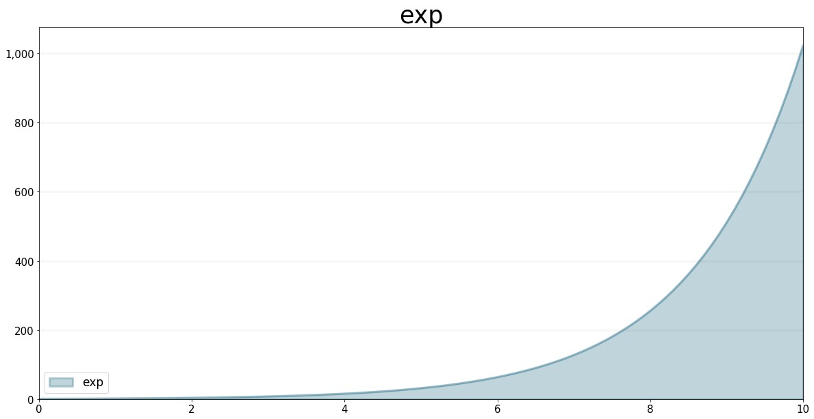
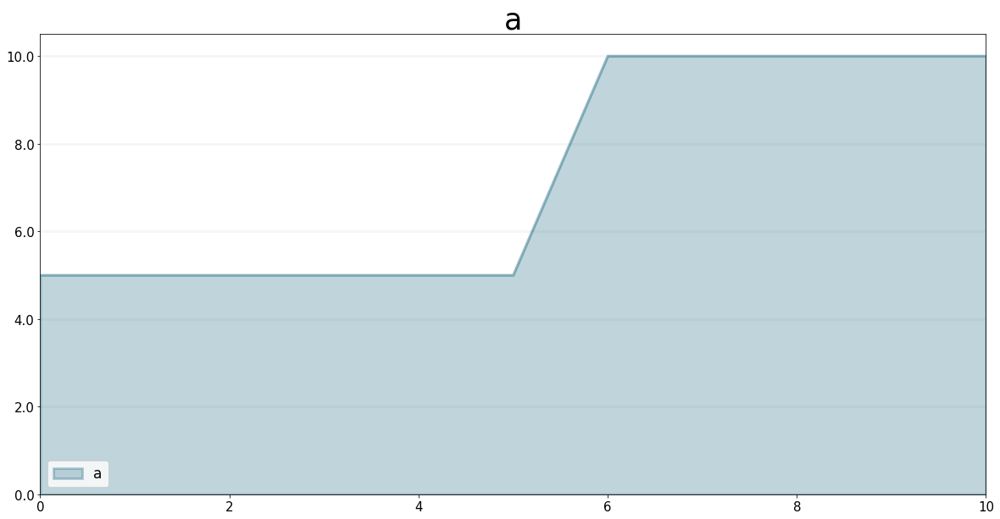
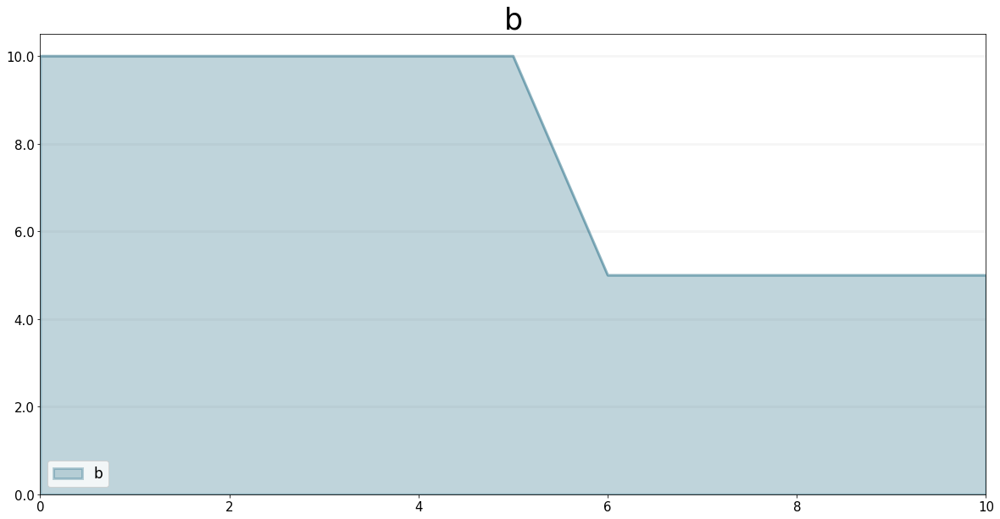
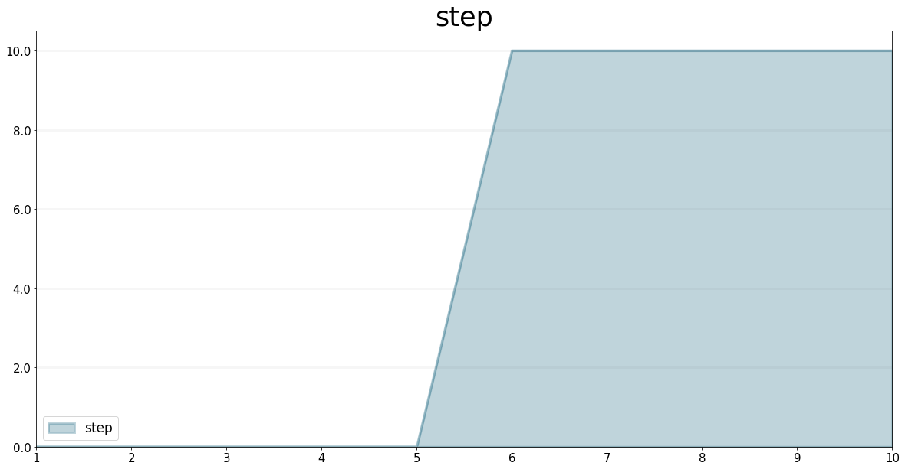
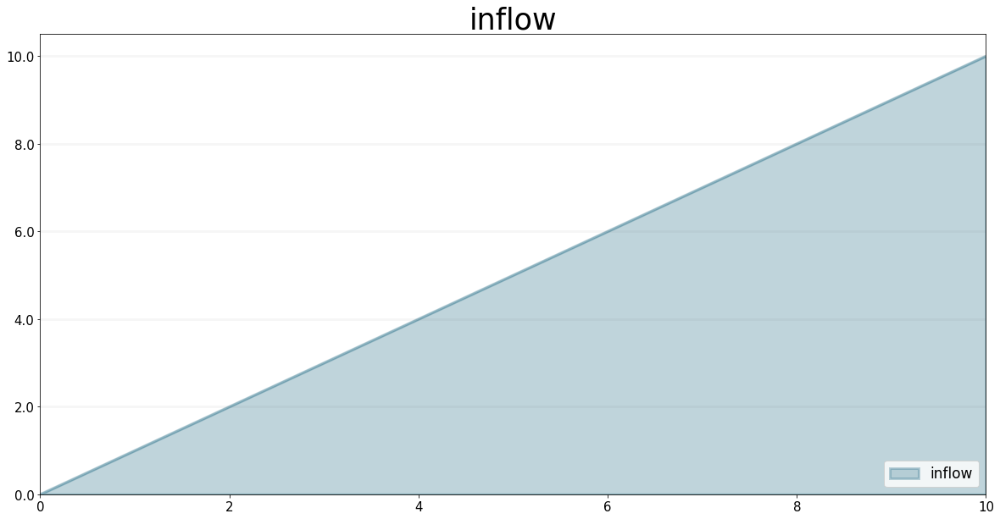
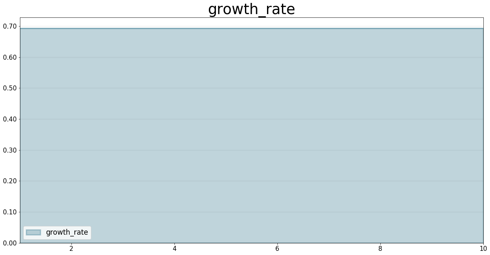

SD DSL Functions
================

This document illustrates how to use the operators for the SD DSL. To use
the operators, you need to import the ``sd_functions``, in addition to
importing the ``Model`` class.

.. code:: ipython3

    from BPTK_Py import Model
    from BPTK_Py import sd_functions as sd
    from BPTK_Py.bptk import bptk
    import numpy as np
    bptk=bptk()

DELAY Function
--------------

The DELAY function returns a delayed value of input, using a fixed lag
time of delay duration, and an optional initial value initial for the
delay. If you don't specify an initial value initial, DELAY assumes the
value to be the initial value of input. If you specify delay duration as
a variable, the DELAY function uses the initial value for its fixed lag
time

Signature:
``delay(model, input_function, delay_duration, initial_value)``

``input_function`` must be a model element ``delay_duration`` and
``initial_value`` must be floats or model elements.

.. code:: ipython3

    model = Model(starttime=0.0,stoptime=10.0,dt=0.1,name='delay')
    
    input_function = model.converter("input_function")
    
    input_function.equation=sd.time()
    
    delayed_input = model.converter("delayed_input")
    
    delayed_input.equation = sd.delay(model,input_function, 1.0)
    
    bptk.register_model(model)
    bptk.plot_scenarios(scenario_managers=["smDelay"],scenarios=["base"],equations=["input_function","delayed_input"])

.. image:: output_5_0.png

EXP Function
------------

The ``exp`` function returns the exponential value of the input.

Signature: ``exp(element)``

``element`` can be any model element (stock, flow, converter, constant)

.. code:: ipython3

    model = Model(starttime=0,stoptime=10,dt=0.1,name='exp')
    
    growth_rate = model.constant("growth_rate")
    
    growth_rate.equation=np.log(2)
    
    exp = model.converter("exp")
    
    exp.equation = sd.exp(growth_rate*sd.time())
    
    exp.plot()

MAX Function
------------

The ``max`` function always chooses the larger of its two input values.

Signature: ``max(element, element)``

``element`` can be any model element (stock, flow, converter, constant)

.. code:: ipython3

    model = Model(starttime=0.0,stoptime=10.0,dt=1.0,name='max')

.. code:: ipython3

    a = model.converter("a")

.. code:: ipython3

    a.equation = 5.0+sd.step(5.0, 5.0)

.. code:: ipython3

    a.plot()

.. code:: ipython3

    b = model.converter("b")

.. code:: ipython3

    b.equation= 10.0 - sd.step(5.0, 5.0)

.. code:: ipython3

    b.plot()

.. code:: ipython3

    c = model.converter("c")

.. code:: ipython3

    c.equation=sd.max(a,b)

.. code:: ipython3

    bptk.register_model(model)
    bptk.plot_scenarios(scenario_managers=["smMax"],scenarios=["base"],equations=["a","b","c"])

.. image:: output_20_0.png

MIN Function
------------

The ``min`` function always chooses the smaller of its two input values.

Signature: ``min(element, element)``

``element`` can be any model element (stock, flow, converter, constant)

.. code:: ipython3

    model = Model(starttime=0,stoptime=10,dt=1,name='min')
    
    a = model.converter("a")
    
    a.equation = 5.0+sd.step(5.0, 5.0)
    
    b = model.converter("b")
    
    b.equation= 10.0 - sd.step(5.0, 5.0)
    
    c = model.converter("c")
    
    c.equation = sd.min(a,b)
    
    bptk.register_model(model)
    bptk.plot_scenarios(scenario_managers=["smMin"],scenarios=["base"],equations=["a","b","c"])

.. image:: output_23_0.png

SMOOTH Function
---------------

The SMOOTH function calculates the exponential average of the input,
given the input function, an initial value and an averaging time.

Signature:
``smooth(model, input_function, averaging_time, initial_value)``

``model``: The model you are writing equations for

``input_function``: any model element

``averaging_time``: any model element

``initial_value``: a floating point value or constant

The SMOOTH operator is a shorthand for the following stock and flow
structure and equations:

.. figure:: smooth_model.png
   :alt: Stock and Flow Structure for the TREND Operator

   Stock and Flow Structure for the TREND Operator

.. code:: ipython3

    model = Model(starttime=1.0,stoptime=10.0,dt=0.1,name='smooth')
    input_function = model.converter("input_function")
    input_function.equation=sd.step(10.0,3.0)
    smooth = model.converter("smooth")
    smooth.equation=sd.smooth(model, input_function,2.0,0.0)
    bptk.register_model(model)
    bptk.plot_scenarios(scenario_managers=["smSmooth"],scenarios=["base"],equations=["input_function","smooth"])

.. image:: output_26_0.png

STEP Function
-------------

The STEP function generates a change of specified height, which occurs
at a specified time.

Signature: ``step(height, timestep)``

``input_function``: any model element or a floating point number

``averaging_time``: any model element or a floating point numnber

``initial_value``: a floating point value or a constant

.. code:: ipython3

    model = Model(starttime=1,stoptime=10,dt=1,name='step')
    
    step = model.converter("step")
    step.equation=sd.step(10.0,5.0)

.. code:: ipython3

    step.plot()

TIME Function
-------------

The ``time`` function returns the current simulation time.

Signature: ``time()``

.. code:: ipython3

    model = Model(starttime=0,stoptime=10,dt=1,name='time')
    
    stock = model.stock("stock")
    
    stock.initial_value=0.0
    
    inflow = model.flow("inflow")
    
    inflow.equation = sd.time()
    
    stock.equation = inflow
    
    inflow.plot()

TREND Function
--------------

The TREND function calculates the trend in the input, given the input,
an initial value and an averaging time. The TREND is defined to be the
fractional change in input compared to the exponential average of input
per averaging time. The TREND function thus estimates the growth rate of
is input function.

Signature:
``trend(model, input_function, averaging_time, initial_value)``

``model``: The model you are writing equations for

``input_function``: any model element

``averaging_time``: any model element

``initial_value``: a floating point value or constant

The TREND operator is a shorthand for the following stock and flow
structure and equations:

.. figure:: trend_model.png
   :alt: Stock and Flow Structure for the TREND Operator

   Stock and Flow Structure for the TREND Operator

.. code:: ipython3

    model = Model(starttime=1,stoptime=10,dt=0.01,name='trend')
    
    growth_rate = model.constant("growth_rate")
    
    growth_rate.equation=np.log(2)
    
    input_function = model.converter("input_function")
    
    input_function.equation = sd.exp(growth_rate*sd.time())
    
    
    trend = model.converter("trend")
    
    trend.equation = sd.trend(model,input_function,1.0,2/(1+np.log(2))) 

As an example, we set up a small model that has an input function that
doubles every timestep - i.e the exponential growth rate is log 2 ≈ 0.69
and then apply the trend function to estimate the growth rate.

Here is a plot of the growth rate, which is constant:

.. code:: ipython3

    growth_rate.plot()

This gives an input function which doubles in value on every timestep:

.. code:: ipython3

    input_function.plot()

.. image:: output_40_0.png

As expexted, the plot of the trend function converges to the input
growth rate:

.. code:: ipython3

    trend.plot()

.. image:: output_42_0.png

