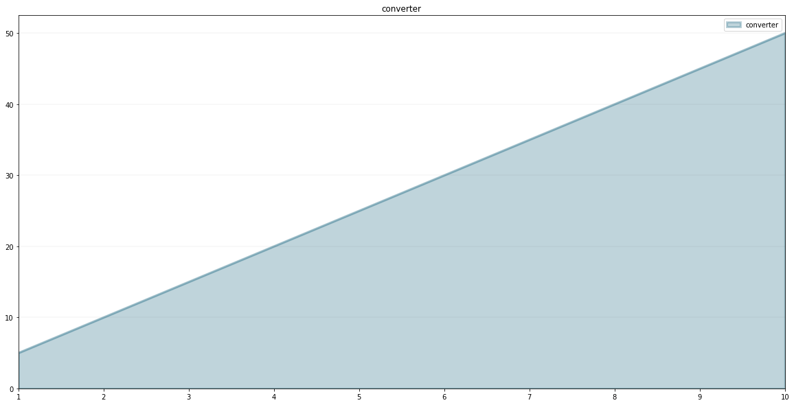
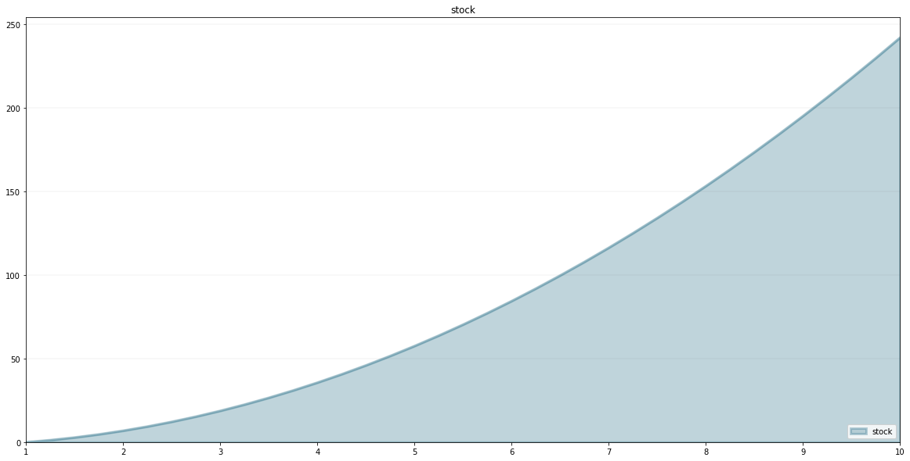
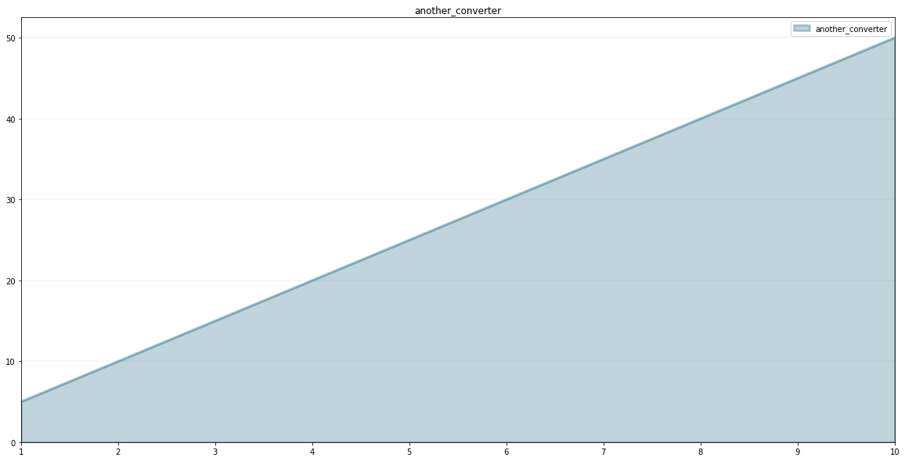
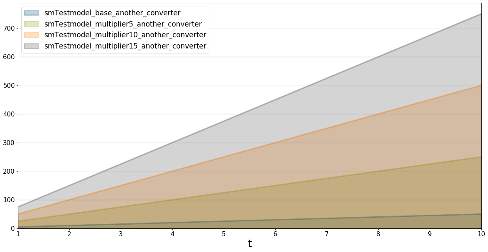

Creating User-defined Functions in SD Models
============================================

.. meta::
   :description: Creating user-defined functions in the SD DSL that is part of the BPTK-Py business simulation framework.
   :keywords: system dynamics, systemdynamics, sd dsl, bptk, bptk-py, python, business simulation

One of the benefits of creating System Dynamics models in Python is that
we can use the full power of Python to create our own functions, which
we can then use in our models.

To illustrate how to do this, let's set up a simple model first:

.. code:: ipython3

    from BPTK_Py import Model
    from BPTK_Py import sd_functions as sd

.. code:: ipython3

    model = Model(starttime=1,stoptime=10,dt=0.25,name='TestModel')

Now let's define a function we would like to use in our model. A user
defined function can have as many arguments as you like, but it must
accept at least a model and time parameter (you don't need to use the
parameters if you don't want to).

How you define your function is up to you - you can use any of the
methods available in Python, such as class methods, using def, or lambda
functions.

The example below uses a lambda function which simply multiplies the
current time ``t`` with 5.

.. code:: ipython3

    my_model_function = model.function("my_model_function", lambda model, t: 5*t)

As you can see, much like with stocks and converters, we associate our
function with the model by calling the models ``function``\ method.

Next we set up a converter:

.. code:: ipython3

    converter = model.converter("converter")

The converter's equation calls the model function.

.. code:: ipython3

    converter.equation = my_model_function()

We can test the function as follows:

.. code:: ipython3

    converter(5)

.. parsed-literal::

    25

Let's plot the function over time:

.. code:: ipython3

    converter.plot()

We can also create a stock that has the converter as an inflow:

.. code:: ipython3

    stock = model.stock("stock")

.. code:: ipython3

    stock.equation = converter

.. code:: ipython3

    stock.plot()

We can do all the usual arithmetic:

.. code:: ipython3

    stock.equation=converter/(sd.time())

.. code:: ipython3

    stock.plot()

.. image:: output_21_0.png

The function we created above was just dependent on time and not on
other model variables. Let's create a function that takes more
arguments, e.g. one that multiplies a model variable with time.

You can add as many arguments as you like, but they must come after the
``model`` and ``t`` arguments.

.. code:: ipython3

    another_model_function = model.function("another_model_function", lambda model, t, input_function, multiplier : t*input_function*multiplier)

Define a new converter which will be the input for the function:

.. code:: ipython3

    input_function = model.converter("input_function")

.. code:: ipython3

    input_function.equation= 5.0

.. code:: ipython3

    multiplier = model.converter("multiplier")

.. code:: ipython3

    multiplier.equation=1.0

Now add a converter which will apply the ``another_model_function``:

.. code:: ipython3

    another_converter = model.converter("another_converter")

.. code:: ipython3

    another_converter.equation=another_model_function(input_function, multiplier)

.. code:: ipython3

    another_converter.plot()

.. code:: ipython3

    from BPTK_Py.bptk import bptk
    import numpy as np
    bptk=bptk()

Of course functions defined in this way can also be used within
scenarios. The quickest way to set up a scenario manager for a given
model is as follows:

.. code:: ipython3

    bptk.register_model(model)

This automatically creates a scenario manager whose name is the name of
the model with the prefix "sm" and a base scenario. The models name is
normalized to start with a capital letter (so TestModel is converted to
smTestmodel).

It also creates a "base" scenario which runs the model as-is, without
any changed settings.

You can list all scenarios and scenario managers using the
``list_scenarios`` method.

.. code:: ipython3

    bptk.list_scenarios(scenario_managers=["smTestmodel"])

.. parsed-literal::

    
    *** smTestmodel ***
    	 base

Let's add some new scenarios:

.. code:: ipython3

    bptk.register_scenarios(
        scenarios =
            {
                "multiplier5": {
                    "constants": {
                        "multiplier": 5.0
                    }
                },
                "multiplier10": {
                    "constants": {
                        "multiplier": 10.0
                    }
                },
                "multiplier15": {
                    "constants": {
                        "multiplier": 15.0
                    }
                }
            }
        ,
        scenario_manager="smTestmodel")

.. code:: ipython3

    bptk.list_scenarios(scenario_managers=["smTestmodel"])

.. parsed-literal::

    
    *** smTestmodel ***
    	 base
    	 multiplier5
    	 multiplier10
    	 multiplier15

.. code:: ipython3

    bptk.plot_scenarios(scenario_managers=["smTestmodel"],scenarios=["base","multiplier5","multiplier10","multiplier15"],equations=["another_converter"])

