SD DSL Functions
================

.. meta::
   :description: Overview of the SD DSL functions that are part of the BPTK-Py business simulation framework.
   :keywords: system dynamics, systemdynamics, sd dsl, bptk, bptk-py, python, business simulation

This document illustrates how to use the operators for the SD DSL. To
use the operators, you need to import the ``sd_functions``, in addition
to importing the ``Model`` class.

.. code:: ipython3

    from BPTK_Py import Model
    from BPTK_Py import sd_functions as sd
    from BPTK_Py.bptk import bptk
    import numpy as np
    bptk=bptk()

IF / THEN / ELSE / AND /NOT / OR
--------------------------------

It is possible to write up if clauses. We even support NOT and AND / OR
operators.

Please note that these function names begin with a capital letter. This
is because the actual words ``if, and, or`` etc. are protected in Python
and cannot / should not be overwritten.

An if clause requires 3 arguments:
``If ( <condition> , <then>, <else>)``

``condition``: Must be a boolean expression, e.g. ``sd.time() > 1`` is
true iff the simulation time is larger than 1 ``then`` : Any expression
that returns a float value if the condition is true ``else`` : Any
expression that returns a float value if the condition is false

A simple if clause may look like this:

.. code:: ipython3

    model = Model(starttime=0.0,stoptime=10.0,dt=0.1,name='if')
    converter = model.converter("converter")
    converter.equation = sd.If( sd.time()>5, 10, 5 )
    converter.plot()

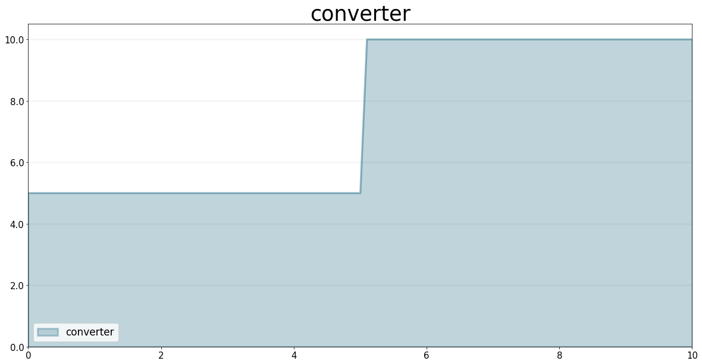

You see that its value is 5 until ``t`` reaches 6.

You can also add ``and`` / ``or`` / ``not`` conditions easily:

Signature: ``And(<condition1>, <condition2>)`` : Logical and between 2
conditions ``Or(<condition1>, <condition2>)`` : Logical or between 2
conditions ``Not(<condition>)`` : Logical not: True if condition is
False

Each condition within the operators has to return a boolean value.
Nesting of the operators is easily possible!

.. code:: ipython3

    converter.equation = sd.If( sd.And(sd.time()>5,sd.time()>10), 10, 5 ) # 5 (else case) as long as t <= 10, then 10
    converter.equation = sd.If( sd.Or( sd.And(sd.time()>5,sd.time()>10), True), 10, 5 ) # Always 10 (then condition, because Or always evaluates to True)
    converter.plot()

ABS Function
------------

The ``ABS``\ function returns the absolute value of its input.

Signature: ``abs(input)``

``input`` may be any model element.

.. code:: ipython3

    model = Model(starttime=0.0,stoptime=10.0,dt=0.1,name='abs')
    
    input_converter = model.converter("input_converter")
    
    input_converter.equation=sd.time()-5
    
    abs_converter = model.converter("abs_converter")
    
    abs_converter.equation = sd.abs(input_converter)
    
    bptk.register_model(model)
    bptk.plot_scenarios(scenario_managers=["smAbs"],scenarios=["base"],equations=["input_converter","abs_converter"])

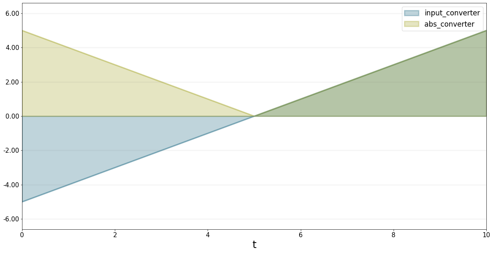

DELAY Function
--------------

The DELAY function returns a delayed value of input, using a fixed lag
time of delay duration, and an optional initial value initial for the
delay. If you don’t specify an initial value initial, DELAY assumes the
value to be the initial value of input. If you specify delay duration as
a variable, the DELAY function uses the initial value for its fixed lag
time

Signature:
``delay(model, input_function, delay_duration, initial_value)``

``input_function`` must be a model element ``delay_duration`` and
``initial_value`` must be floats or model elements.

.. code:: ipython3

    model = Model(starttime=0.0,stoptime=10.0,dt=0.1,name='delay')
    
    input_function = model.converter("input_function")
    
    input_function.equation=sd.time()
    
    delayed_input = model.converter("delayed_input")
    
    delayed_input.equation = sd.delay(model,input_function, 1.0)
    
    bptk.register_model(model)
    bptk.plot_scenarios(scenario_managers=["smDelay"],scenarios=["base"],equations=["input_function","delayed_input"])

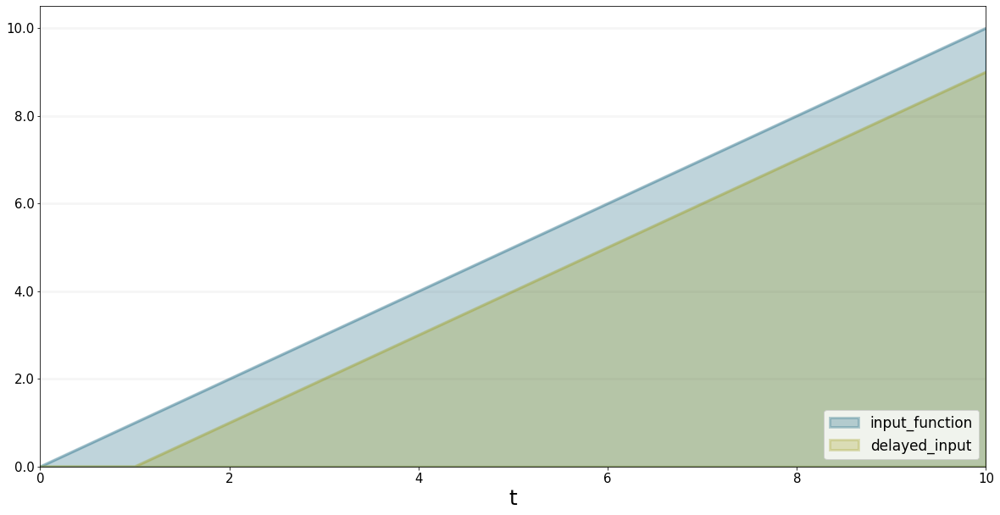

DT Function
-----------

The ``DT`` function returns the models dt..

Signature: ``dt(model)``

.. code:: ipython3

    model = Model(starttime=5,stoptime=12,dt=0.25,name='dt')
    dt = model.converter("dt")
    dt.equation = sd.dt(model)
    dt.plot()

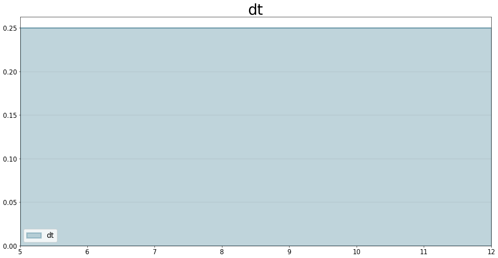

EXP Function
------------

The ``exp`` function returns the exponential value of the input.

Signature: ``exp(element)``

``element`` can be any model element (stock, flow, converter, constant)

.. code:: ipython3

    model = Model(starttime=0,stoptime=10,dt=0.1,name='exp')
    
    growth_rate = model.constant("growth_rate")
    
    growth_rate.equation=np.log(2)
    
    exp = model.converter("exp")
    
    exp.equation = sd.exp(growth_rate*sd.time())
    
    exp.plot()

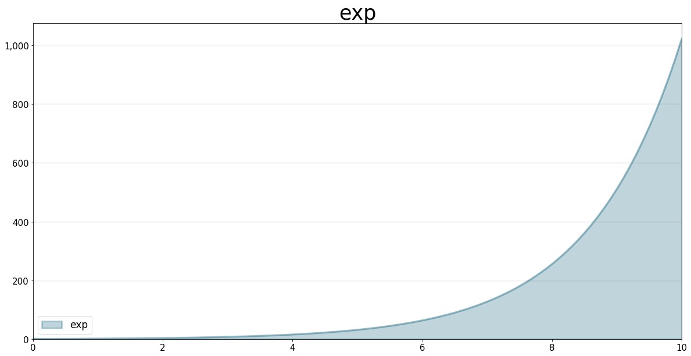

MAX Function
------------

The ``max`` function always chooses the larger of its two input values.

Signature: ``max(element, element)``

``element`` can be any model element (stock, flow, converter, constant)

.. code:: ipython3

    model = Model(starttime=0.0,stoptime=10.0,dt=1.0,name='max')

.. code:: ipython3

    a = model.converter("a")

.. code:: ipython3

    a.equation = 5.0+sd.step(5.0, 5.0)

.. code:: ipython3

    a.plot()

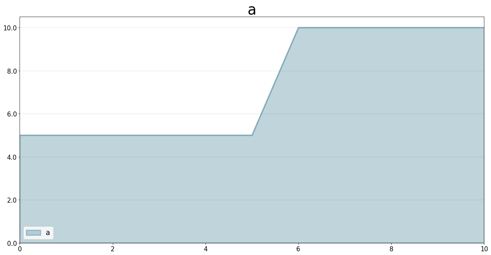

.. code:: ipython3

    b = model.converter("b")

.. code:: ipython3

    b.equation= 10.0 - sd.step(5.0, 5.0)

.. code:: ipython3

    b.plot()

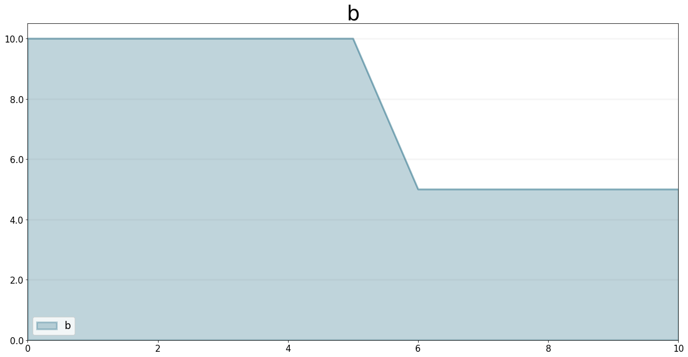

.. code:: ipython3

    c = model.converter("c")

.. code:: ipython3

    c.equation=sd.max(a,b)

.. code:: ipython3

    bptk.register_model(model)
    bptk.plot_scenarios(scenario_managers=["smMax"],scenarios=["base"],equations=["a","b","c"])

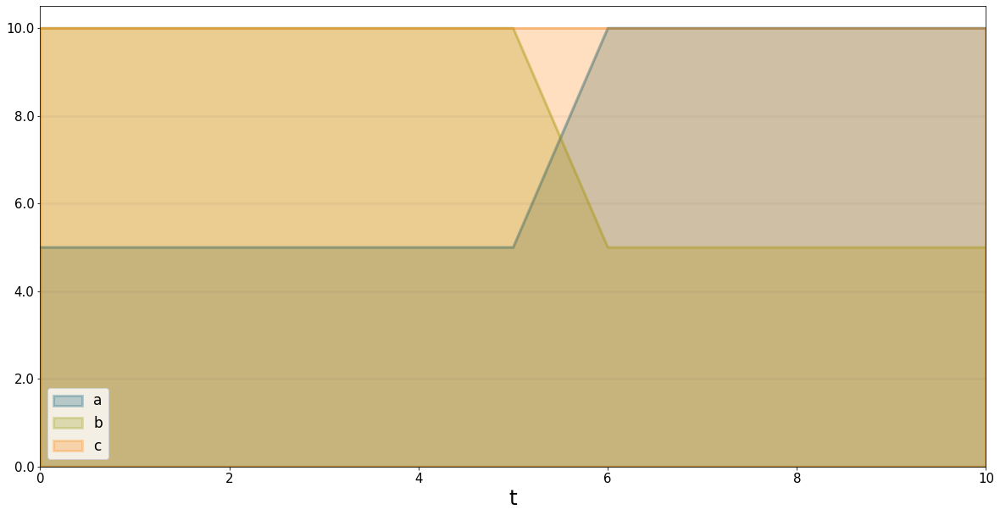

MIN Function
------------

The ``min`` function always chooses the smaller of its two input values.

Signature: ``min(element, element)``

``element`` can be any model element (stock, flow, converter, constant)

.. code:: ipython3

    model = Model(starttime=0,stoptime=10,dt=1,name='min')
    
    a = model.converter("a")
    
    a.equation = 5.0+sd.step(5.0, 5.0)
    
    b = model.converter("b")
    
    b.equation= 10.0 - sd.step(5.0, 5.0)
    
    c = model.converter("c")
    
    c.equation = sd.min(a,b)
    
    bptk.register_model(model)
    bptk.plot_scenarios(scenario_managers=["smMin"],scenarios=["base"],equations=["a","b","c"])

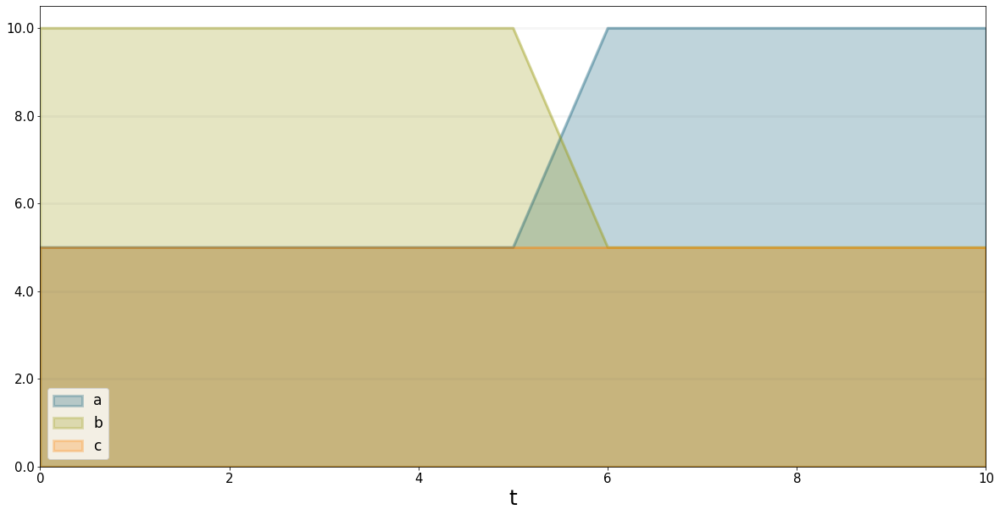

PULSE Function
--------------

The ``PULSE`` function generates a pulse input of a specified size
(volume). When using the PULSE builtin, you have the option of setting
the time at which the PULSE will first fire (first pulse), as well as
the interval between subsequent PULSEs. Each time that it fires a pulse,
the framework pulses the specified volume over a period of one time step
(DT). Thus, the instantaneous value taken on by the PULSE function is
volume/DT.

Signature: ``pulse(model, volume, first_pulse=0, interval=0)``

Setting ``interval`` to 0 yields a single pulse that doesn’t repeat

``volume`` can be either a variable or a constant, ``first_pulse`` and
``interval`` must be constants.

.. code:: ipython3

    model = Model(starttime=0.0,stoptime=10.0,dt=0.25,name='pulse')
    
    stock = model.stock("stock")
    stock.initial_value=0.0
    
    flow = model.flow("flow")
    flow.equation=sd.pulse(model,10.0,2.0,2.0)
    
    stock.equation = flow
    
    bptk.register_model(model)
    bptk.plot_scenarios(scenario_managers=["smPulse"],scenarios=["base"],equations=["stock","flow"])

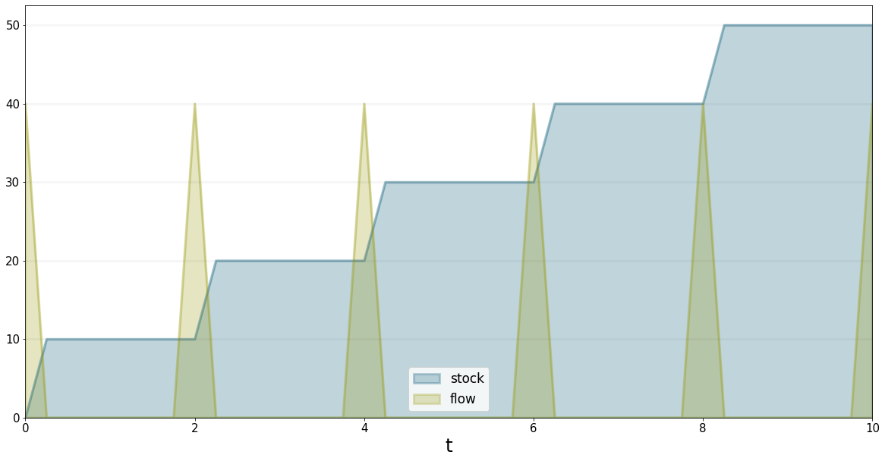

SMOOTH Function
---------------

The SMOOTH function calculates the exponential average of the input,
given the input function, an initial value and an averaging time.

Signature:
``smooth(model, input_function, averaging_time, initial_value)``

``model``: The model you are writing equations for

``input_function``: any model element

``averaging_time``: any model element

``initial_value``: a floating point value or constant

The SMOOTH operator is a shorthand for the following stock and flow
structure and equations:

.. figure:: smooth_model.png
   :alt: Stock and Flow Structure for the TREND Operator

   Stock and Flow Structure for the TREND Operator

.. code:: ipython3

    model = Model(starttime=1.0,stoptime=10.0,dt=0.1,name='smooth')
    input_function = model.converter("input_function")
    input_function.equation=sd.step(10.0,3.0)
    smooth = model.converter("smooth")
    smooth.equation=sd.smooth(model, input_function,2.0,0.0)
    bptk.register_model(model)
    bptk.plot_scenarios(scenario_managers=["smSmooth"],scenarios=["base"],equations=["input_function","smooth"])

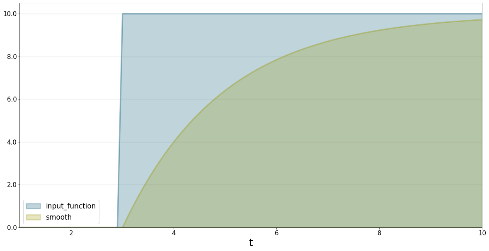

STARTTIME Function
------------------

The ``STARTTIME`` function returns the models starttime.

Signature: ``starttime(model)``

.. code:: ipython3

    model = Model(starttime=5,stoptime=12,dt=1,name='starttime')
    starttime = model.converter("starttime")
    starttime.equation = sd.starttime(model)
    starttime.plot()

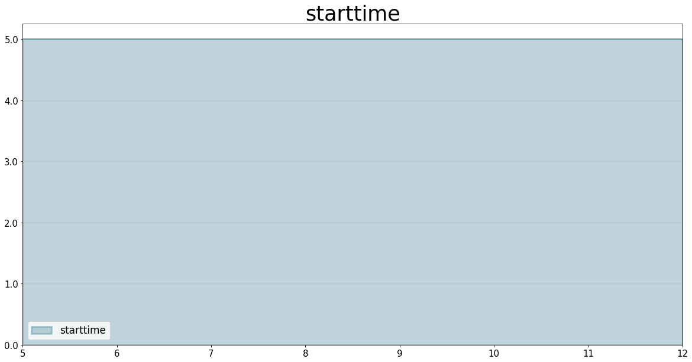

STOPTIME Function
-----------------

The ``STOPTIME`` function returns the models starttime.

Signature: ``stoptime(model)``

.. code:: ipython3

    model = Model(starttime=5,stoptime=12,dt=1,name='stoptime')
    stoptime = model.converter("stoptime")
    stoptime.equation = sd.stoptime(model)
    stoptime.plot()

.. image:: in_depth_sd_dsl_functions_45_0.png

STEP Function
-------------

The STEP function generates a change of specified height, which occurs
at a specified time.

Signature: ``step(height, timestep)``

``input_function``: any model element or a floating point number

``averaging_time``: any model element or a floating point numnber

``initial_value``: a floating point value or a constant

.. code:: ipython3

    model = Model(starttime=1,stoptime=10,dt=1,name='step')
    
    step = model.converter("step")
    step.equation=sd.step(10.0,5.0)

.. code:: ipython3

    step.plot()

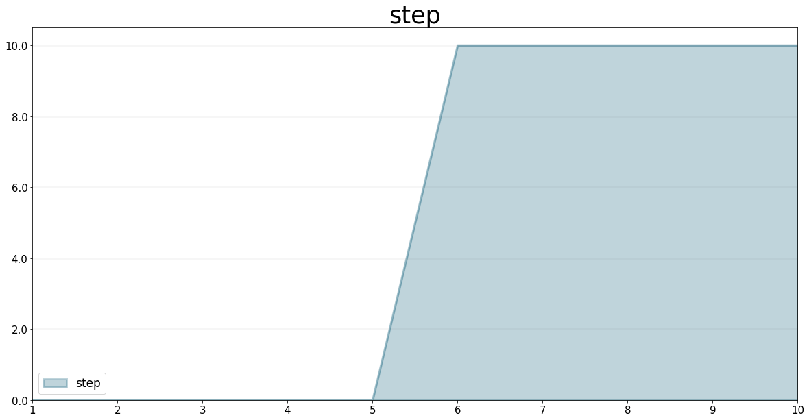

TIME Function
-------------

The ``time`` function returns the current simulation time.

Signature: ``time()``

.. code:: ipython3

    model = Model(starttime=0,stoptime=10,dt=1,name='time')
    
    stock = model.stock("stock")
    
    stock.initial_value=0.0
    
    inflow = model.flow("inflow")
    
    inflow.equation = sd.time()
    
    stock.equation = inflow
    
    inflow.plot()

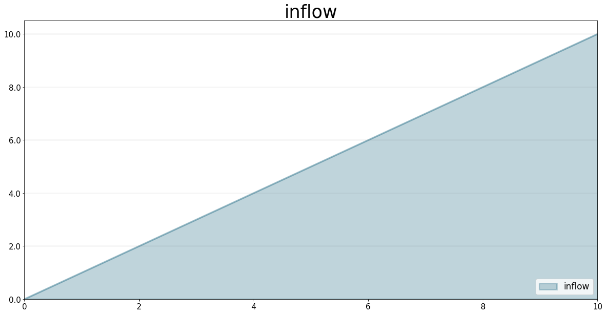

TREND Function
--------------

The TREND function calculates the trend in the input, given the input,
an initial value and an averaging time. The TREND is defined to be the
fractional change in input compared to the exponential average of input
per averaging time. The TREND function thus estimates the growth rate of
is input function.

Signature:
``trend(model, input_function, averaging_time, initial_value)``

``model``: The model you are writing equations for

``input_function``: any model element

``averaging_time``: any model element

``initial_value``: a floating point value or constant

The TREND operator is a shorthand for the following stock and flow
structure and equations:

.. figure:: trend_model.png
   :alt: Stock and Flow Structure for the TREND Operator

   Stock and Flow Structure for the TREND Operator

.. code:: ipython3

    model = Model(starttime=1,stoptime=10,dt=0.01,name='trend')
    
    growth_rate = model.constant("growth_rate")
    
    growth_rate.equation=np.log(2)
    
    input_function = model.converter("input_function")
    
    input_function.equation = sd.exp(growth_rate*sd.time())
    
    
    trend = model.converter("trend")
    
    trend.equation = sd.trend(model,input_function,1.0,2/(1+np.log(2))) 

As an example, we set up a small model that has an input function that
doubles every timestep - i.e the exponential growth rate is log 2 ≈ 0.69
and then apply the trend function to estimate the growth rate.

Here is a plot of the growth rate, which is constant:

.. code:: ipython3

    growth_rate.plot()

This gives an input function which doubles in value on every timestep:

.. code:: ipython3

    input_function.plot()

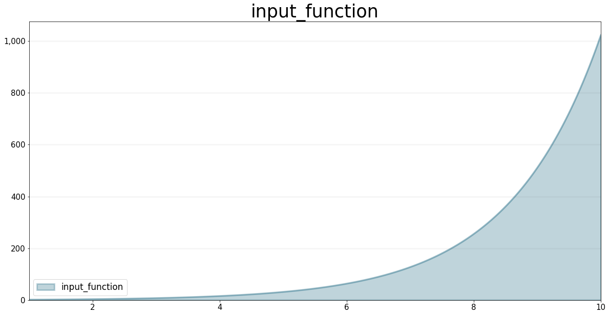

As expexted, the plot of the trend function converges to the input
growth rate:

.. code:: ipython3

    trend.plot()

.. image:: in_depth_sd_dsl_functions_61_0.png

ROUND Function
--------------

This function rounds any input to a specified number of digits.

Signature: ``round(expression, digits)``

``expression`` can be any float input by any expression. ``digits`` must
be an int value

A minimal example that rounds random numbers between 0 and 2 to 0 digits
(int number):

.. code:: ipython3

    model = Model(starttime=0.0,stoptime=10.0,dt=0.25,name='round')
    flow = model.flow("round")
    flow.equation = sd.round( sd.random(0, 2), 0 )
    flow.plot()

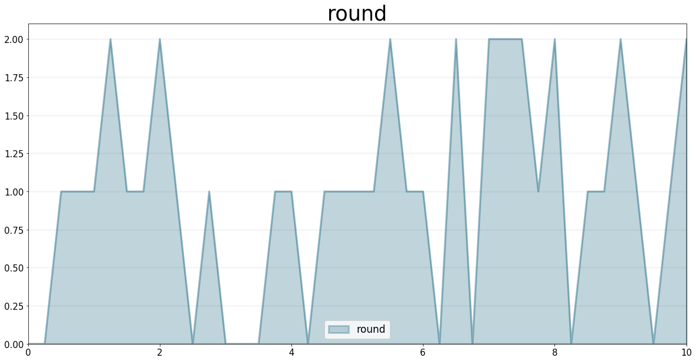

Computes the Square root of an input expression.

Signature: ``sqrt(expression)``

``expression`` can be any element that returns a float value.

Simple Example:

.. code:: ipython3

    m= Model(starttime=0,stoptime=10,dt=1)
    f = m.flow(name="sqrt")
    
    val = sd.time() 
    
    f.equation = sd.sqrt(val)
    f.plot()

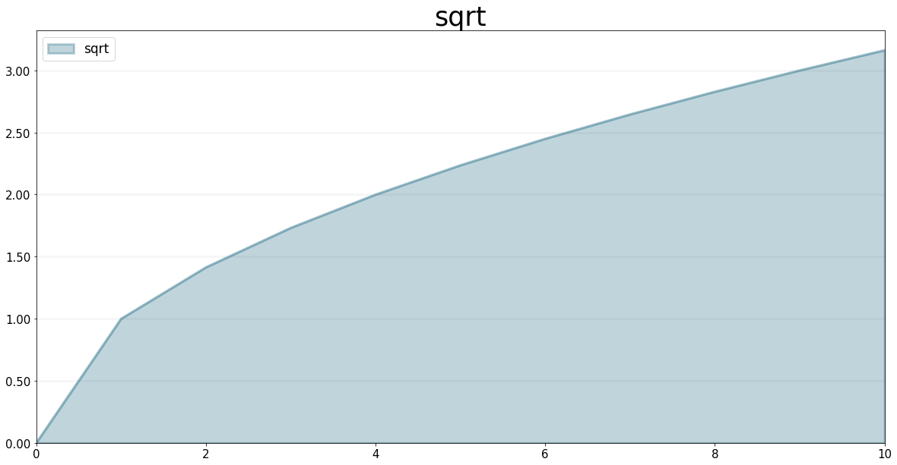

NAN / INF / PI
--------------

``sd.nan()`` returns a NAN value, ``sd.Inf()`` gives you the infinity
value, ``sd.pi()`` returns the number pi.

SIN / TAN / COS and ARCCOS / ARCSIN / ARCTAN
--------------------------------------------

The SD DSl supports all trigonometric that you are also used to from
other SD simulation / modelling tools

Use ``sd.sin(x) / sd.cos(x) / sd.tan(x)`` for sinus, cosinus or tangent
of x (radians) and ``sd.arcsin(x) / sd.arctan(x) / sd.arccos(x)`` for
the respective arctan / arccos and arcsine operators.

Let’s easily plot sin / cos and tan for the current simulation time:

.. code:: ipython3

    m= Model(starttime=0,stoptime=10,dt=0.1)
    sin = m.flow(name="sin")
    tan = m.flow(name="tan")
    cos = m.flow(name="cos")
    x = sd.time() 
    
    sin.equation = sd.sin(x)
    tan.equation = sd.tan(x)
    cos.equation = sd.cos(x)
    
    sin.plot()
    tan.plot()
    cos.plot()

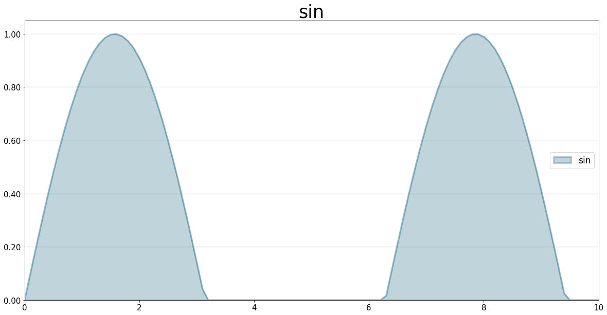

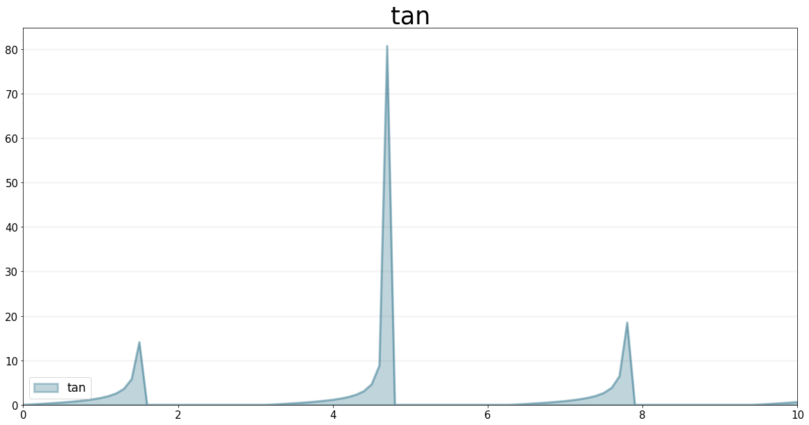

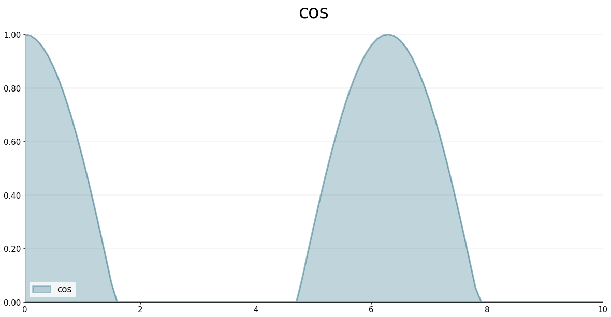

SINWAVE and COSWAVE function
----------------------------

SINWAVE returns a time-dependent sine wave, with the specified amplitude
and period. To generate the sine wave, the SINWAVE builtin uses the
absolute value of the amplitude you specify. To produce meaningful wave
results, choose a DT that’s significantly smaller than the period of the
wave. A DT equal to a quarter of the period gives triangle waves. A
smaller DT gives results which better approximate a continuous curve.

COSWAVE generates a time-dependent **cosine** wave. It uses the same
arguments

Signature: ``sinwave(amplitude,period)``

``amplitude`` : Amplitude of the sine wave ``period`` : Period of the
sine wave

Example:

.. code:: ipython3

    m= Model(starttime=0,stoptime=10,dt=0.1)
    f = m.flow(name="sinwave")
    g = m.flow("coswave")
    amplitude = 10
    period = 5
    
    f.equation = sd.sinwave(amplitude, period)
    g.equation = sd.coswave(amplitude, period)
    f.plot()
    g.plot()

.. image:: in_depth_sd_dsl_functions_70_0.png

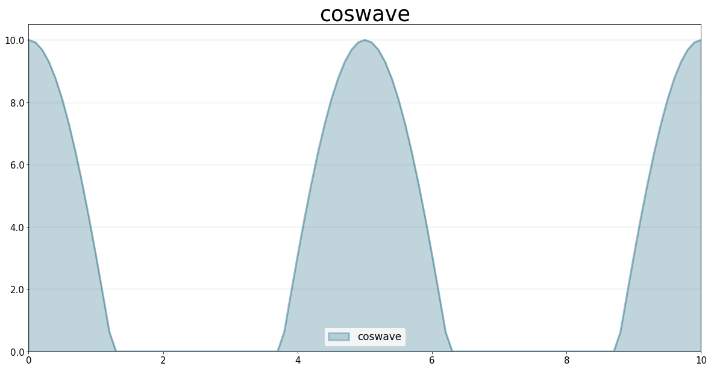

BETA Function
-------------

The BETA operator generates a series of random numbers that conforms to
a beta distribution defined by two shape arguments, ``alpha`` and
``beta``.

Example:

.. code:: ipython3

    m= Model(starttime=0,stoptime=10,dt=0.1)
    f = m.flow(name="beta")
    alpha = 1
    beta = 2
    f.equation = sd.beta(alpha, beta)
    f.plot()

.. image:: in_depth_sd_dsl_functions_72_0.png

BINOMIAL
--------

This operator generates a series of random numbers from a discrete
probability distribution of the number of successes in a sequence of
trials with a given success probability. The success probability should
be a number between 0 and 1.

Arguments are ``number of trials (n)`` and ``success probability (p)``.

A quick example:

.. code:: ipython3

    m= Model(starttime=0,stoptime=10,dt=0.1)
    f = m.flow(name="binomial")
    n = 100
    p = 0.1
    f.equation = sd.binomial(n, p)
    f.plot()

.. image:: in_depth_sd_dsl_functions_74_0.png

COMBINATIONS
------------

The COMBINATIONS operator calculates the number of r-element subsets (or
r-combinations) of an n-element set.

Arguments are ``n`` and ``r``.

Example with ``time`` as ``n``:

.. code:: ipython3

    m= Model(starttime=3,stoptime=10,dt=1)
    f = m.flow(name="combinations")
    n = sd.time()
    r = 1
    f.equation = sd.combinations(n,r)
    f.plot()

.. image:: in_depth_sd_dsl_functions_76_0.png

EXPRND Function
---------------

This operator generates a series of exponentially distributed random
numbers with a given ``mean``.

Example:

.. code:: ipython3

    m= Model(starttime=0,stoptime=10,dt=0.1)
    f = m.flow(name="exprnd")
    
    mean = sd.time()
    f.equation = sd.exprnd(mean)
    f.plot()

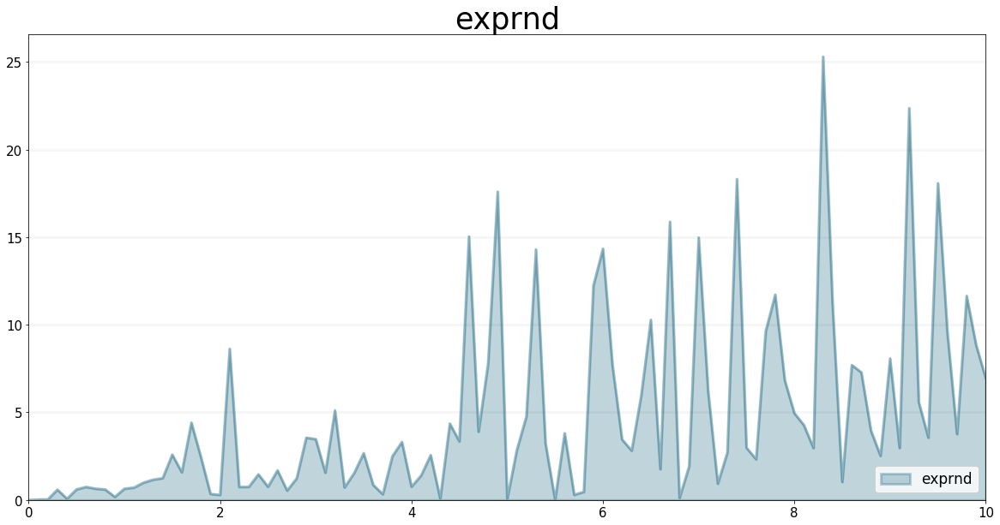

FACTORIAL Function
------------------

The FACTORIAL function calculates the factorial of the single argument
``n`` (traditionally noted as n!). ``n`` must be an integer value,
decimal values are not allowed.

Example:

.. code:: ipython3

    m= Model(starttime=0,stoptime=10,dt=0.1)
    f = m.flow(name="factorial")
    
    n = 5
    
    f.equation = sd.factorial(n)
    f.plot()

.. image:: in_depth_sd_dsl_functions_80_0.png

GAMMA Function
--------------

The GAMMA builtin generates a series of random numbers that conforms to
a gamma distribution with the specified ``shape`` and ``scale``. If
unspecified, ``scale`` uses the value 1.0

Example:

.. code:: ipython3

    m= Model(starttime=0,stoptime=10,dt=0.1)
    f = m.flow(name="gamma")
    
    shape = 10
    scale = sd.time()
    
    f.equation = sd.gamma(shape, scale)
    f.plot()

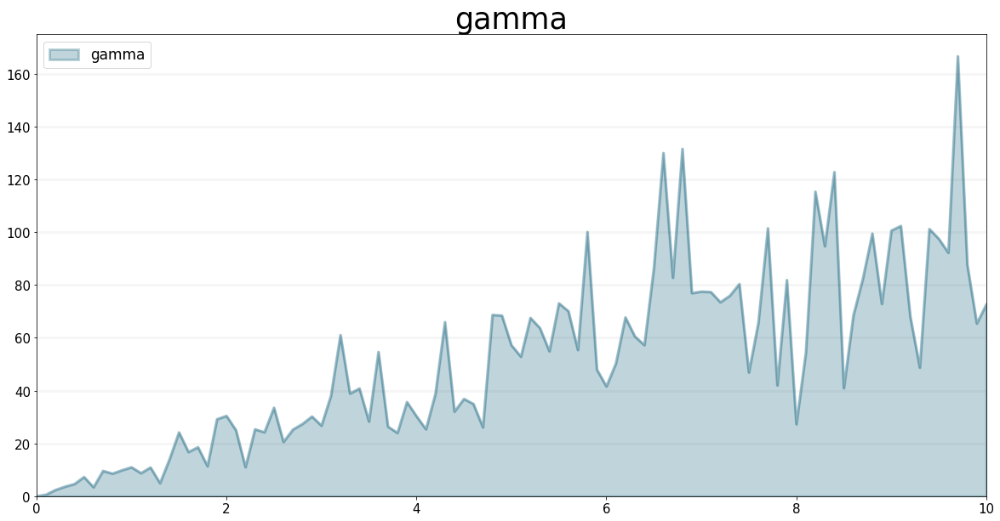

GAMMALN Function
----------------

The GAMMALN operator returns the natural log of the GAMMA function,
given input n. The GAMMA function is a continuous version of the
FACTORIAL builtin, with GAMMA(n) the same as FACTORIAL(n-1).

Only argument is ``n``

.. code:: ipython3

    m= Model(starttime=0,stoptime=10,dt=0.1)
    f = m.flow(name="gammaln")
    
    n = sd.time()
    f.equation = sd.gammaln(n)
    f.plot()

.. image:: in_depth_sd_dsl_functions_84_0.png

GEOMETRIC Function
------------------

The GEOMETRIC operator generates a series of random numbers from a
discrete probability distribution of the number of trials before the
first success with a given ``success probability (p)``.

``p`` is the only parameter. It should be any value between 0 and 1.

Example:

.. code:: ipython3

    m= Model(starttime=0,stoptime=10,dt=0.1)
    f = m.flow(name="geometric")
    
    p = 0.1
    
    f.equation = sd.geometric(p)
    f.plot()

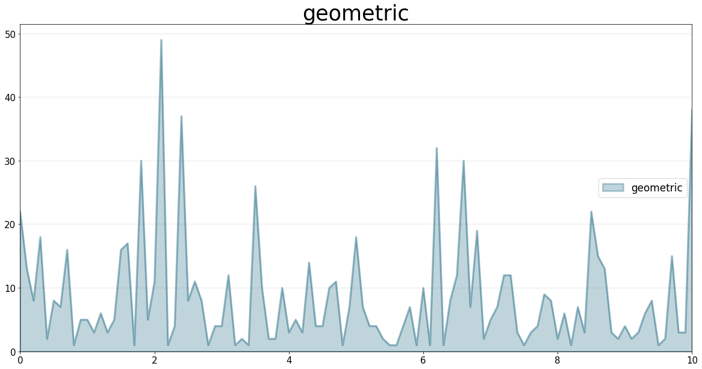

INVNORM Function
----------------

The INVNORM operator calculates the inverse of the NORMALCDF function
(see below).

Parameter is the ``probability p`` (any value between 0 and 1).

Example:

.. code:: ipython3

    m= Model(starttime=-0.5,stoptime=1,dt=0.1)
    f = m.flow(name="invnorm")
    
    p = sd.time()
    
    f.equation = sd.invnorm(p)
    f.plot()

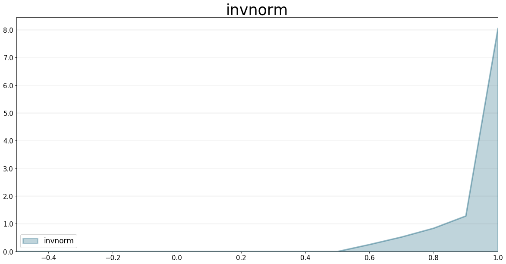

LOGISTIC Function
-----------------

The LOGISTIC operator generates a series of random numbers that conforms
to a logistic distribution with a specified ``mean`` and ``scale``.

Example:

.. code:: ipython3

    m= Model(starttime=-1,stoptime=10,dt=0.1)
    f = m.flow(name="logistic")
    
    mean = 0
    scale = 1
    
    f.equation = sd.logistic(mean, scale)
    f.plot()

.. image:: in_depth_sd_dsl_functions_90_0.png

LOGNORMAL Function
------------------

The LOGNORMAL operator generates a series of random numbers that conform
to a Log-Normal distribution (that is, the log of the independent
variable follows a normal distribution) with a specified mean and stddev
(standard deviation). LOGNORMAL samples a new random number in each
iteration of a simulation.

Arguments are ``mean`` and ``standard deviation``

Example:

.. code:: ipython3

    m= Model(starttime=0,stoptime=10,dt=0.1)
    f = m.flow(name="lognormal")
    
    mean = 0
    stdev = 1
    f.equation = sd.lognormal(mean, stdev)
    f.plot()

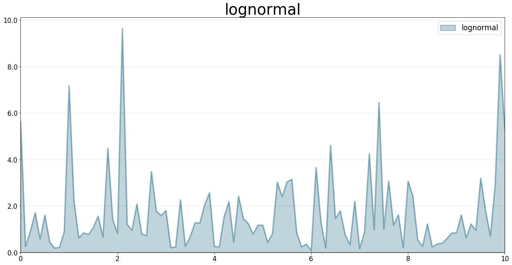

MONTECARLO Function
-------------------

The MONTECARLO operator randomly generates a series of zeros and ones
from a Bernoulli distribution based on the probability you’ve provided.
The probability is the percentage probability of an event happening per
unit of simulation time. The probability value can be either a variable
or a constant, but should evaluate to a number between 0 and 100.

MONTECARLO is equivalent to the following logic:

IF (RANDOM(0,100,) < probability*DT THEN 1 ELSE 0

Example:

.. code:: ipython3

    m= Model(starttime=0,stoptime=10,dt=0.1)
    f = m.flow(name="montecarlo")
    
    probability = 50
    f.equation = sd.montecarlo(probability)
    f.plot()

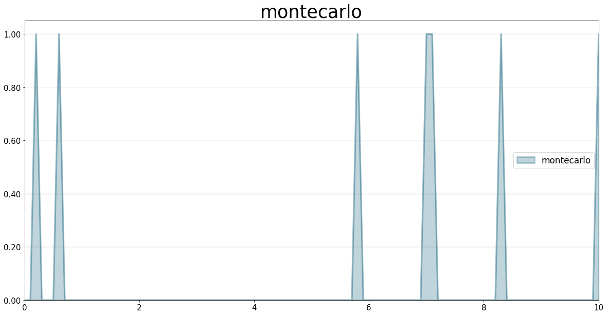

NORMAL Function
---------------

The NORMAL operator generates a series of normally distributed random
numbers with a specified mean and stddev (standard deviation).

Arguments are ``mean`` and the ``standard deviation`` of the underlying
normal distribution.

Example:

.. code:: ipython3

    m= Model(starttime=0,stoptime=10,dt=1)
    f = m.flow(name="normal")
    
    mean = 0
    stdev = 1
    f.equation = sd.normal(mean, stdev)
    f.plot()

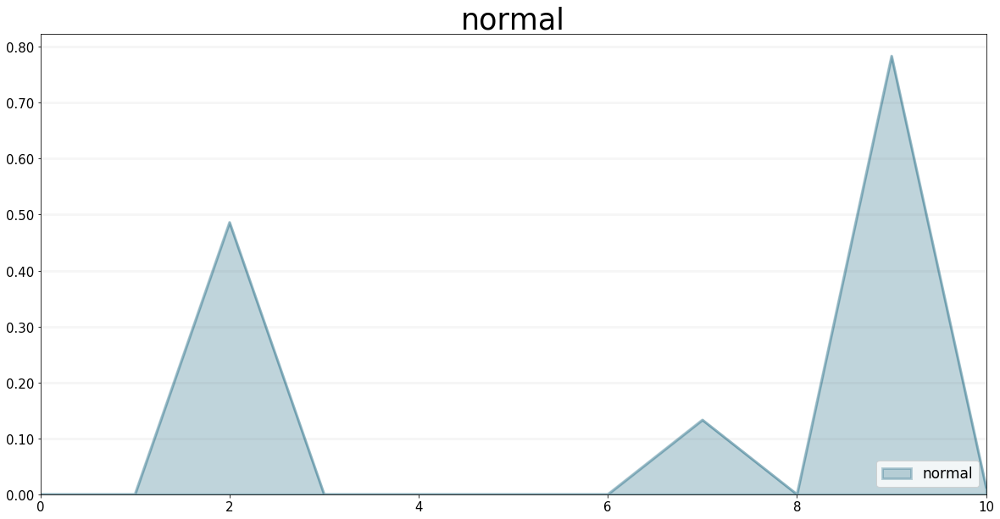

NORMALCDF Function
------------------

The NORMALCDF operator calculates the cumulative Normal distribution
function between the specified z-scores, or, when the mean and stddev
(standard deviation) are given, between two data values.

Arguments are the ``left`` and ``right`` boundaries and optionally
``mean`` and ``stddev``. If not given, mean will be set to 0, stddev to
1.

A really simple example:

.. code:: ipython3

    m= Model(starttime=-4,stoptime=4,dt=0.1)
    f = m.flow(name="normalCDF")
    left = -4
    right = sd.time()
    mean = 0
    stddev = 1
    f.equation = sd.normalcdf(left, right, mean, stddev)
    f.plot()

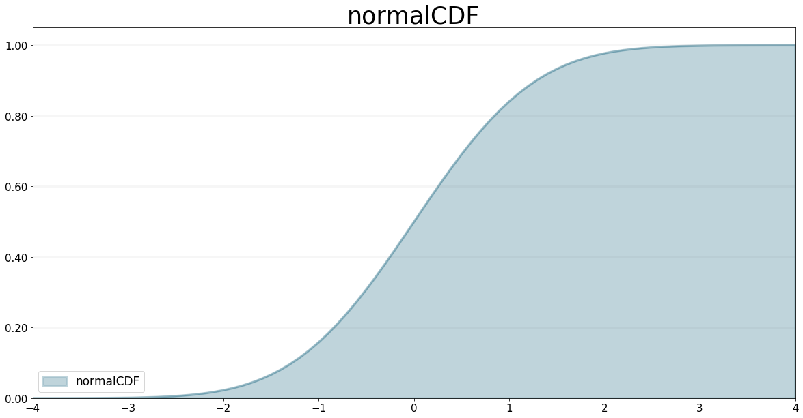

PARETO Function
---------------

The PARETO operator generates a series of random numbers that conforms
to a distribution whose log is exponentially distributed with a
specified shape and scale

Arguments are ``shape`` and ``scale``.

Example:

.. code:: ipython3

    m= Model(starttime=1,stoptime=10,dt=0.1)
    f = m.flow(name="pareto")
    shape = 1
    scale = 1
    
    f.equation = sd.pareto(shape, scale)
    f.plot()

.. image:: in_depth_sd_dsl_functions_100_0.png

PERMUTATIONS
------------

The PERMUTATIONS operator calculates the number of permutations of an
n-element set with r-element subsets.

Arguments are ``n`` and ``r``. Note that both numbers should be integer
values.

Example:

.. code:: ipython3

    m= Model(starttime=1,stoptime=10,dt=0.1)
    f = m.flow(name="permutations")
    n = 7.0
    r = 3
    
    f.equation = sd.permutations(n, r)
    f.plot()

.. image:: in_depth_sd_dsl_functions_102_0.png

POISSON Function
----------------

The POISSON operator generates a series of random numbers that conform
to a Poisson distribution. The mean value of the output is mu \* DT.

Only argument is ``mu``, a float or integer number or any operator that
returns a number.

Example (with an increasing ``mu`` expressed as the current simulation
time):

.. code:: ipython3

    m= Model(starttime=1,stoptime=10,dt=0.1)
    f = m.flow(name="poisson")
    mu = sd.time()
    
    f.equation = sd.poisson(mu)
    f.plot()

.. image:: in_depth_sd_dsl_functions_104_0.png

RANDOM / UNIFORM Function
-------------------------

RANDOM and UNIFORM both draw a random number between a minimum and
maximum value that conforms to a uniform distribution. For compatibility
to modelling practices, we included both into the SD DSL (just as the
Stella Architect builtins).

Arguments are the ``min_value`` and ``max_value`` between which the
random number should lie. If not given, the random number is between 0
and 1.

Simple example where the number always lies between DT and the current
simulation time:

.. code:: ipython3

    m= Model(starttime=1,stoptime=10,dt=0.1)
    f = m.flow(name="uniform / random")
    min_value = 0.1
    max_value = sd.time()
    
    f.equation = sd.random(min_value, max_value)
    f.plot()

.. image:: in_depth_sd_dsl_functions_106_0.png

TRIANGULAR Function
-------------------

The TRIANGULAR operator generates a series of random numbers that
conforms to a triangular distribution with a specified ``lower bound``,
``mode``, and ``upper bound``.

A simple example with the current simulation time as upper bound:

.. code:: ipython3

    m= Model(starttime=1,stoptime=10,dt=0.1)
    f = m.flow(name="triangular")
    lower_bound = 0
    mode = 1
    upper_bound = sd.time()
    
    f.equation = sd.triangular(lower_bound, mode, upper_bound)
    f.plot()

.. image:: in_depth_sd_dsl_functions_108_0.png

WEIBULL Function
----------------

The WEIBULL operator generates a series of random numbers that conforms
to a Weibull distribution with the specified ``shape`` and ``scale``.

Let’s create a quick example with ``scale`` set to the current
simulation time:

.. code:: ipython3

    m= Model(starttime=1,stoptime=10,dt=0.1)
    f = m.flow(name="weibull")
    shape = 1
    scale = sd.time()
    
    f.equation = sd.weibull(shape, scale)
    f.plot()

.. image:: in_depth_sd_dsl_functions_110_0.png

