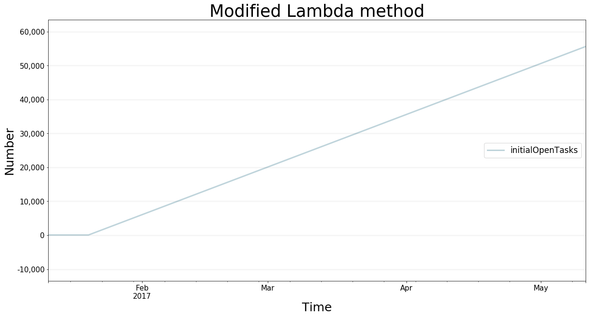

Modifying Models At Runtime
===========================

Now it gets really interesting and rather complex. The goal is to
replace certain equations of the model with custom lambda functions at
runtime.

First we need to obtain the scenarios and their corresponding simulation
models and replace the given equations with the new lambda. An extended
strategy is just another dictionary. In general, it looks like this:

::

    scenarios = bptk.get_scenarios(scenario_managers=["smSimpleProjectManagement"])

    extended_strategy= {
        "scenario80" : {
            "10" : { 
                "initialOpenTasks" : lambda t :0 if t <= 1 else 42 + scenarios["scenario80"].model.memoize("initialOpenTasks",t-1) ,
            }
        }    
    }

You see that this concept is rather complex and requires understanding
of Python. First we have to load all available scenarios. The dictionary
contains *pointers* to the specific scenario objects that we loaded from
the scenario files. They are stored in the ``ScenarioManager`` object
instance of the ``bptk`` object. The lambda functions now have to use
these scenarios pointers to receive the pointers to the ``model`` object
(and therefore the equations) of the simulation model. We will overwrite
the specific equations with the given lambda function(s) in the
previously-described strategy dictionary of the scenario. It is possible
to store lambda functions just like this as strings in JSON **but** the
complexity is even higher when it comes to adding it to the model during
run-time. As the bptk object uses the same set of scenarios, it will use
the same object pointers when we finally issue
``bptk.plot_scenarios(... ,strategy=True)``

We begin with defining the new, extended strategy. It plays a around
with the initial open Tasks. It will return 0 if at starttime of the
model. Otherwise, it returns the value of t-dt multiplied by 1,000. See
also how we get the dt and start time of the model by accessing the
scenarios.

.. code:: ipython3

    from BPTK_Py.bptk import bptk
    bptk=bptk()
    scenarios = bptk.get_scenarios(scenario_managers=["smSimpleProjectManagement"])
    
    dt = scenarios["scenario80"].model.dt
    
    
    extended_strategy= {
        "scenario80" : {
            "10" : { 
                "initialOpenTasks" : lambda t :0 if t <= 1 else 500 + scenarios["scenario80"].model.memoize("initialOpenTasks",t-1) ,
                "deadline" : lambda t : 80
            }
        }    
    }
    
    bptk.modify_strategy(scenarios=scenarios,extended_strategy=extended_strategy)
    

And now we run the method
``bptk.modify_strategy(scenarios,extended_strategy)``. It receives the
pointers to the scenarios object and the modifications to the existing
strategy. The method will just take the dictionary and fill up the
strategy field of the scenario(s) with the lambda function objects.

Please keep in mind that ``bptk`` stores the old lambda function. It
runs the simulation until ``t-1``, inserts the new function and
continues until the next change. If you want to re-run the scenario with
another modified strategy, just flush the ``ScenarioManager``'s
``scenario`` object:

::

    bptk.reset_simulation_model(scenario_name="scenario80",scenario_manager="smSimpleProjectManagement")

This will cause the scenario manager to reload the scenario's simulation
model from the source file. Finally, you may use the plotting methods
with the ``strategy=True`` parameter for simulating and plotting the
modified scenarios.

.. code:: ipython3

    ## Plot the graph with the extended stratefy
    bptk.plot_scenarios(
        scenario_managers=["smSimpleProjectManagement"],
        scenarios=["scenario80"],
        kind="line",
        equations=["initialOpenTasks"],
        stacked=False, 
        strategy=True,
        freq="D", 
        start_date="1/11/2017",
        title="Modified Lambda method",
        x_label="Time",
        y_label="Number"
    )

