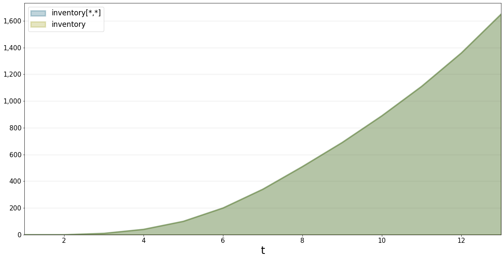
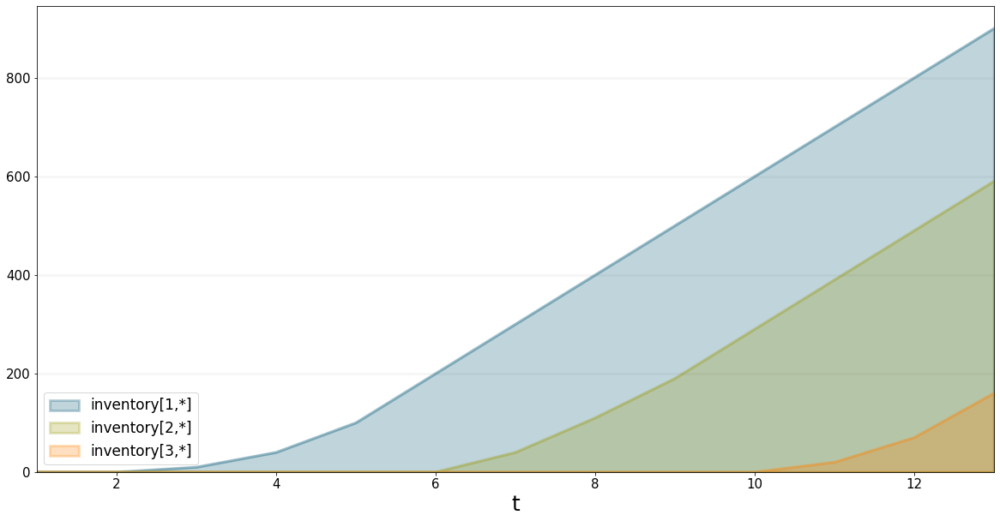
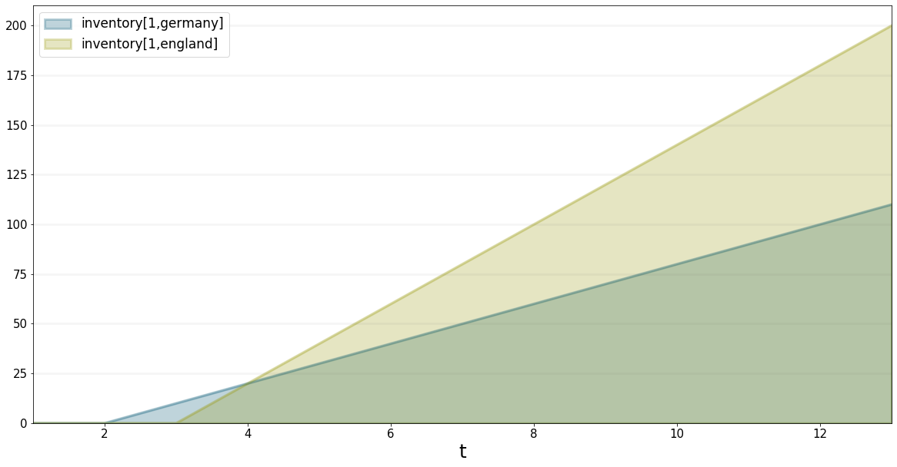
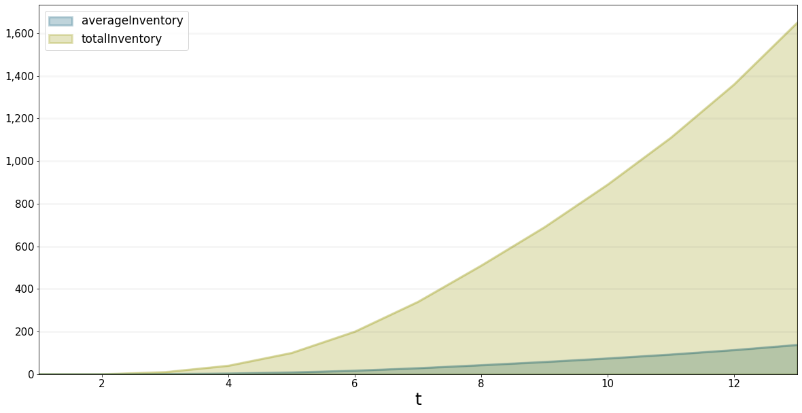

Working with Arrayed Variables in XMILE Models
==============================================

This document illustrates how to work with XMILE models that contain
arrays.

BPTK_Py supports arrayed variables out of the box. You can access them
easily just the way you would in Stella Equations. This lets you plot
them easily. The advantage of analysing arrayed variables in BPTK_Py is
that you can plot anything easily and quickly. It supports a rapid and
quick analytics approach. Along with Jupyter, you can create great
stories, pointing out cost drivers and growth opportunities for your
business models.

A simple arrayed model
----------------------

Let’s have a look at an example. We are working with a model simulating
a production chain. It comes with 2 dimensions (country and product).
Country is any of Germany, England, Austria or Greece. The products are
identified by numbers 1 to 3.

The important components of the model are the 2 stocks ``Production``
and ``Inventory`` and the flows ``production start`` and
``production rate``. The converters mostly compute averages or means for
demonstration purposes.

.. figure:: sd_arrayed_1.png
   :alt: sd_arrayed_1.png

   sd_arrayed_1.png

Plot total of all dimensions
----------------------------

Let us suppose, for an initial data analysis we want to get a high level
overview over the inventory for all products in all countries. For this
purpose, BPTK_Py supports the asterisk and array notation
``inventory[*,*]`` as we are used to from Stella Architect. For
simplification purposes, we also added a shortcut. For the sum of all
dimensions of a stock, you can just use the name of the stock without
any array operator.

Hence, plotting ``inventory[*,*]`` and ``inventory`` returns the same
graph:

.. code:: ipython3

    bptk.plot_scenarios(
        scenario_managers=["smArrayedVariables"],
        scenarios=["base"], 
        equations=["inventory[*,*]","inventory"]
    )

Analyse a single product inventory in all countries
---------------------------------------------------

Now that we saw a rising inventory for all products in all countries, we
want to get to the bottom of it and understand which product drives the
inventory

.. code:: ipython3

    bptk.plot_scenarios(
        scenario_managers=["smArrayedVariables"],
        scenarios=["base"], 
        equations=["inventory[1,*]","inventory[2,*]","inventory[3,*]"]
    )

We learned that the inventory for product 1 is very high. Further
analysis may include looking at the countries and where the inventory is
especially high, i.e. plotting ``inventory`` for all countries:
``inventory[1,germany], inventory[1,england]`` and so on:

.. code:: ipython3

    bptk.plot_scenarios(
        scenario_managers=["smArrayedVariables"],
        scenarios=["base"], 
        equations=["inventory[1,germany]","inventory[1,england]"]
    )

We observe that the inventory rises early in Germany but England quickly
surpasses at t=3. Further analysis may be possible here. But for
demonstration purposes, let us jump over to another interesting
features.

Advanced Array Functions
------------------------

But for now, let’s go ahead and look at more advanced plotting
functions. BPTK_Py supports all array functions as outlined in the
`Stella Architect builtins
documentation <https://www.iseesystems.com/resources/help/v1-9/default.htm#08-Reference/07-Builtins/Array_builtins.htm>`__

In the model, we built a converter ``average Inventory`` using the
``MEAN`` equation: ``MEAN(Inventory[*; *])``. The converter
``total Inventory`` uses the ``SUM`` function. It returns the same
results as when using ``inventory[*,*]`` in BPTK_Py. The transpiler
makes sure to translate the equations properly to simulate them in
Python:

.. code:: ipython3

    bptk.plot_scenarios(
        scenario_managers=["smArrayedVariables"],
        scenarios=["base"], 
        equations=["averageInventory","totalInventory"]
    )

Finished
--------

That’s it for now. You learned how easy it is to work with arrayed elements in
XMILE models using BPTK_Py. This functionality lets you quickly analyse
your model and draw conclusions, all within the great Jupyter
environment!
